# API Market + 网关 Scope 校验架构图解

场景：API Market 平台统一管理 API 与 scope 的映射关系，网关集中验证 scope，资源服务器零改动。

---

## 一、整体架构

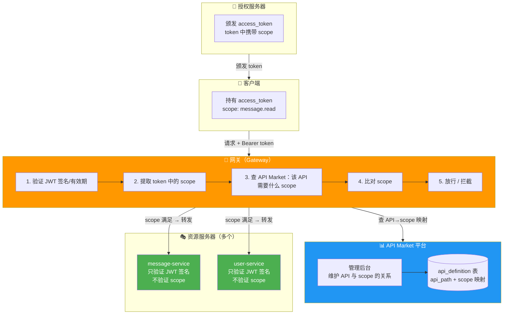

---

## 二、完整请求时序图

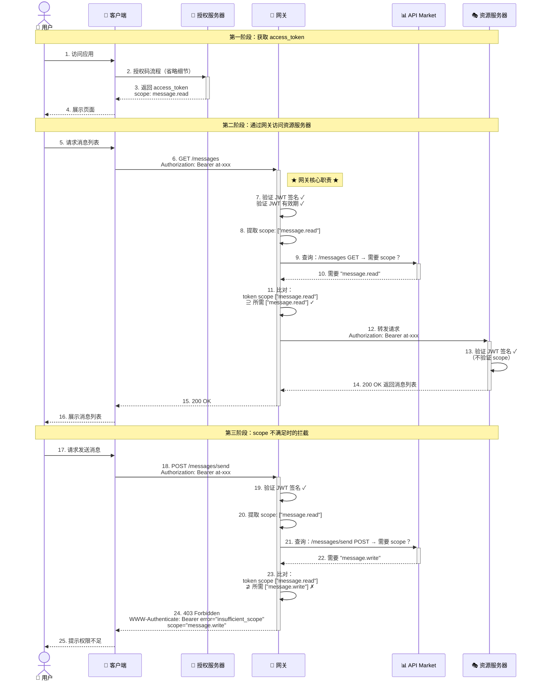

---

## 三、网关 Scope 校验流程图

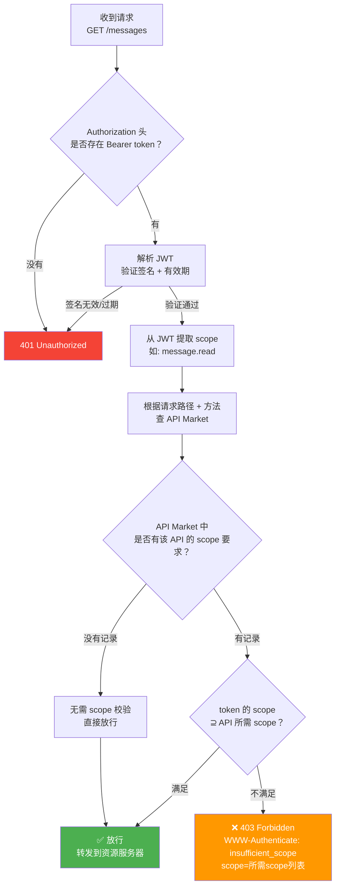

---

## 四、API Market 数据模型

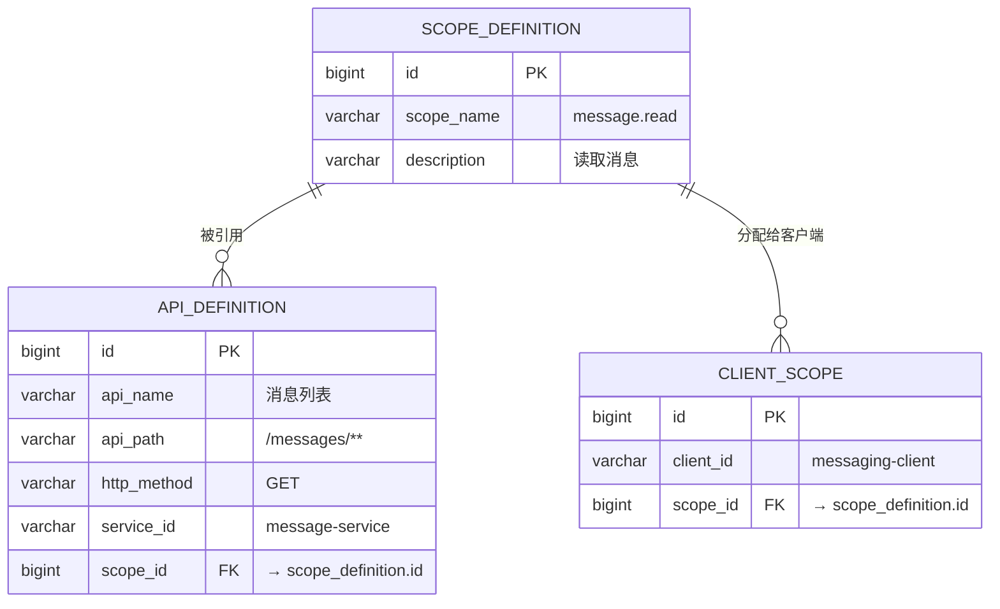

### 示例数据

**scope_definition**

| id | scope_name | description |
|----|-----------|-------------|
| 1 | message.read | 读取消息 |
| 2 | message.write | 发送/删除消息 |
| 3 | user.read | 读取用户信息 |

**api_definition**

| id | api_name | api_path | http_method | service_id | scope_id |
|----|----------|----------|-------------|------------|----------|
| 1 | 消息列表 | /messages/** | GET | message-service | 1 |
| 2 | 发送消息 | /messages/send | POST | message-service | 2 |
| 3 | 删除消息 | /messages/*/delete | POST | message-service | 2 |
| 4 | 用户信息 | /user/** | GET | user-service | 3 |

**client_scope**（客户端申请 client_id 时分配的 scope）

| id | client_id | scope_id |
|----|-----------|----------|
| 1 | messaging-client | 1 |
| 2 | messaging-client | 2 |
| 3 | user-client | 3 |

---

## 五、各组件职责对比

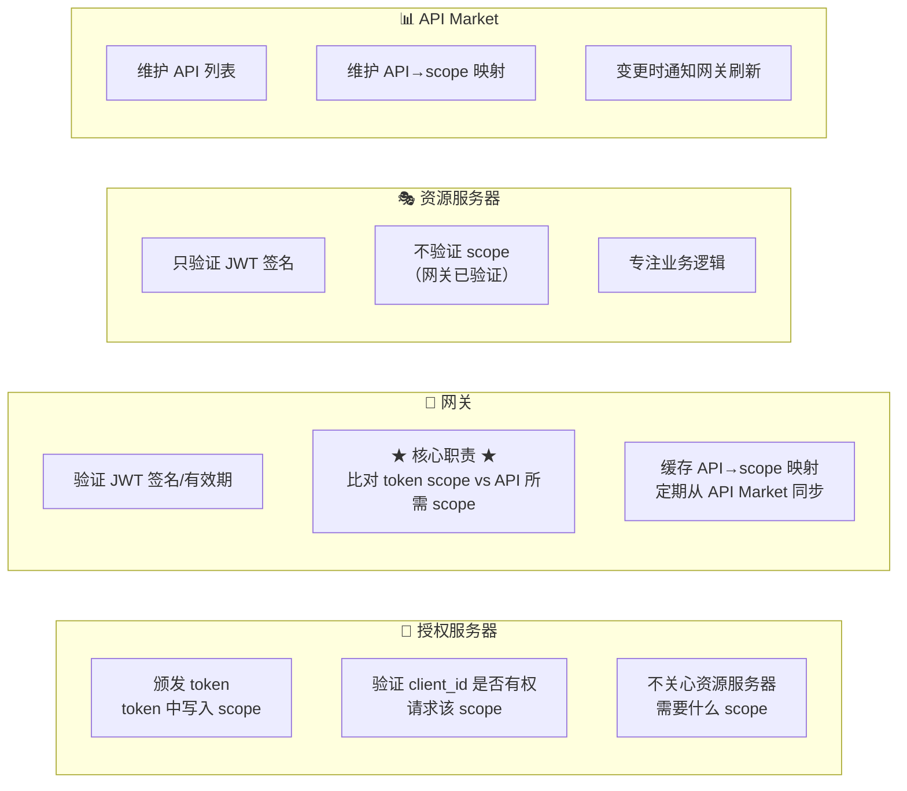

| 组件 | 验证 JWT 签名 | 验证 scope | 维护 scope 规则 | 说明 |
|------|:---:|:---:|:---:|------|
| 授权服务器 | ✅ 颁发时 | ❌ | ❌ | 只管"给谁发什么 scope"，不管"谁需要什么 scope" |
| 网关 | ✅ | ✅ **核心** | ❌ | 执行者：比对 token scope 和 API 所需 scope |
| 资源服务器 | ✅ | ❌ | ❌ | 只验签名，scope 校验已由网关完成 |
| API Market | ❌ | ❌ | ✅ **核心** | 数据源：定义"哪个 API 需要什么 scope" |

---

## 六、Cookie / Session / Token 分布

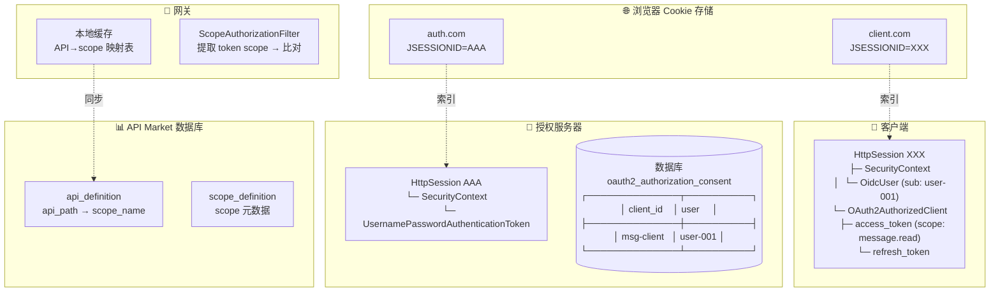

---

## 七、网关缓存刷新机制

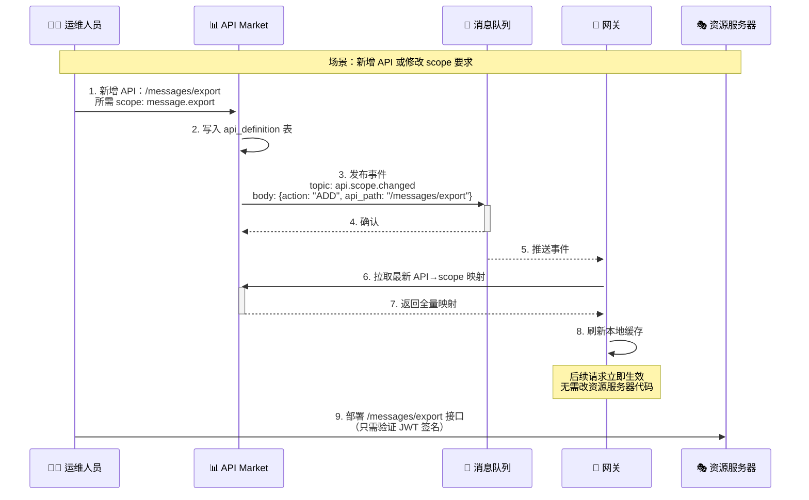

---

## 八、客户端 Scope 不足时的处理流程

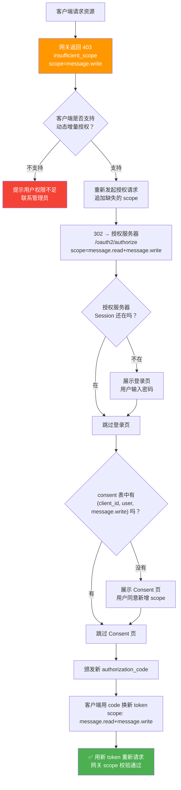

---

## 九、与传统方案对比

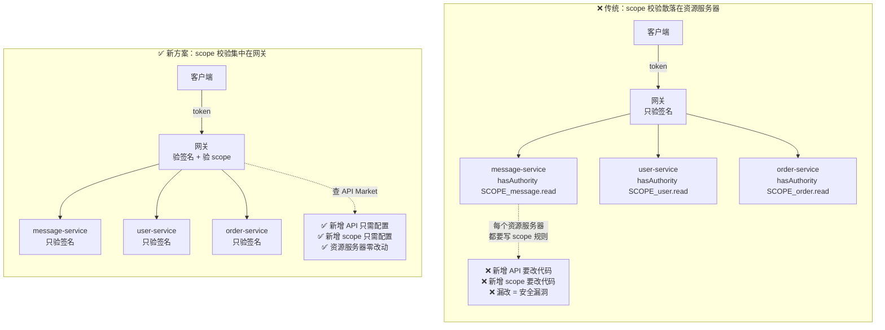

| 对比项 | 传统方案 | 新方案 |
|--------|---------|--------|
| scope 校验位置 | 每个资源服务器 | **网关集中** |
| 新增 API | 改资源服务器代码 | **API Market 配置** |
| 新增 scope | 改资源服务器代码 | **API Market 配置** |
| 资源服务器模板 | 各不相同 | **统一：只验签名** |
| 漏改风险 | 高（漏改 = 漏洞） | **无（网关统一入口）** |
| scope 规则可见性 | 分散在各服务 | **API Market 一目了然** |

---

## 十、核心结论

1. **网关是 scope 校验的唯一执行者**，资源服务器只验证 JWT 签名，不验证 scope
2. **API Market 是 scope 规则的唯一数据源**，定义"哪个 API 需要什么 scope"
3. **客户端申请 client_id 时分配 scope**，授权服务器只按分配的 scope 颁发 token
4. **授权服务器不管 scope 校验**，只管"给谁发什么 scope"，不管"谁需要什么 scope"
5. **网关通过缓存 + 消息总线感知变更**，API Market 修改后网关自动刷新，无需重启
6. **资源服务器代码完全统一**：`anyRequest().authenticated()` + `jwt(Customizer.withDefaults())`，零 scope 逻辑
7. **scope 不足时客户端可动态增量授权**，重新发起授权请求追加缺失的 scope

---

## 十一、API Market Scope 设计方案（To C 平台）

> 基于对微信、支付宝、京东、抖音、快手、百度、微博、小红书共 8 个平台的 scope 调研结论，结合 **To C 平台有用户信息** 的特性，以及 API Market 网关集中校验架构，制定以下 scope 设计方案。

### 11.1 设计决策：融合微信/支付宝的静默授权 + 京东的业务域读写分离

本平台是 **To C** 平台，核心特征：
- 有 C 端用户，需要第三方应用代表用户操作（authorization_code 流程）
- 需要静默识别用户身份（如自动登录），不需要弹窗确认
- 同时也有服务间调用场景（client_credentials 流程）

| 候选模式 | 代表平台 | 与本平台的匹配度 | 结论 |
|----------|----------|----------------|------|
| scope 区分静默/非静默 | 支付宝、微信 | ✅ **极高**。To C 场景核心需求：静默获取 openid 识别用户，非静默获取用户信息 | **核心采用** |
| `业务域.操作类型` 读写分离 | 京东 | ✅ 高。业务 API 需要精细权限控制，命名可预测 | **主体采用** |
| 三种权限勾选状态 | 抖音 | ⚠️ 部分。Consent 页可提供"必须/可选"勾选 | 参考采用 |
| 基础/高级分层 | 微博 | ⚠️ 部分。静默授权天然就是"基础层" | 参考采用 |
| 极简 3 scope | 百度 | ❌ 低。多业务域，3 个 scope 远不够 | 不采用 |
| 粗粒度 | 快手 | ❌ 低。`user_info` 一个 scope 含全部信息，太粗 | 不采用 |

**最终决策**：

```
核心架构 = 微信/支付宝的「静默/非静默」模式（用户身份层）
         + 京东的「业务域.操作类型」模式（业务 API 层）
         + 抖音的「必须/可选」勾选状态（Consent 页体验）
```

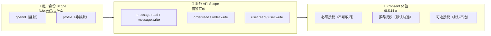

### 11.2 Scope 命名规范

#### 命名格式

**用户身份 Scope**（借鉴微信 `snsapi_` 前缀、支付宝 `auth_` 前缀）：

```
<身份域>
```

无点分、无操作后缀。身份 scope 是特殊的存在，不遵循业务域规则。

**业务 API Scope**（借鉴京东 `业务域.操作类型`）：

```
<业务域>.<操作类型>
```

- **业务域**：小写英文，对应一组相关 API 资源
- **操作类型**：`read`（读取）或 `write`（写入/创建/删除）
- **分隔符**：点号 `.`

#### 命名规则

| 规则 | 说明 | 示例 |
|------|------|------|
| 身份 scope 是特殊命名 | 不遵循业务域规则，单独定义 | `openid`、`profile` |
| 业务域对应微服务 | 一个微服务对应一个业务域 | `message-service` → `message.*` |
| 读写严格分离 | 读取用 `.read`，写入/创建/删除用 `.write` | `order.read` / `order.write` |
| 只读资源无 write | 如果业务域只有查询接口，则只有 `.read` | `category.read` |
| 禁止超细粒度 | 不拆到字段级别 | ✅ `user.read` ❌ `user.email.read` |
| 禁止超粗粒度 | 不使用 `all`、`*` 等通配 scope | ❌ `api.all` ❌ `*` |

#### 命名对比

```
❌ 不好的命名                         ✅ 好的命名（本方案）
─────────────────────────────         ─────────────────────────────
snsapi_base            (微信风格)      openid
auth_user              (支付宝风格)     profile
user_info              (太粗)          profile + user.read
message                (无操作)        message.read / message.write
msg_r                  (缩写不明)      message.read
user.email.read        (太细)          user.read
api.all                (太危险)        按业务域逐个分配
```

### 11.3 Scope 完整清单

#### 11.3.1 用户身份 Scope（authorization_code 专用）

| Scope | 说明 | 是否静默 | 映射 API | 对标平台 |
|-------|------|----------|----------|----------|
| `openid` | 获取用户唯一标识（sub/openid），不弹窗 | ✅ 静默 | `GET /userinfo`（仅返回 sub） | 微信 `snsapi_base` / 支付宝 `auth_base` |
| `profile` | 获取用户基本信息（昵称、头像等），弹窗确认 | ❌ 非静默 | `GET /userinfo`（返回 sub + 昵称 + 头像） | 微信 `snsapi_userinfo` / 支付宝 `auth_user` |
| `phone` | 获取用户手机号，弹窗确认 | ❌ 非静默 | `GET /user/phone` | 微信小程序 `scope.phone` |
| `email` | 获取用户邮箱，弹窗确认 | ❌ 非静默 | `GET /user/email` | 百度 `email` |

**静默授权规则**（借鉴微信/支付宝）：

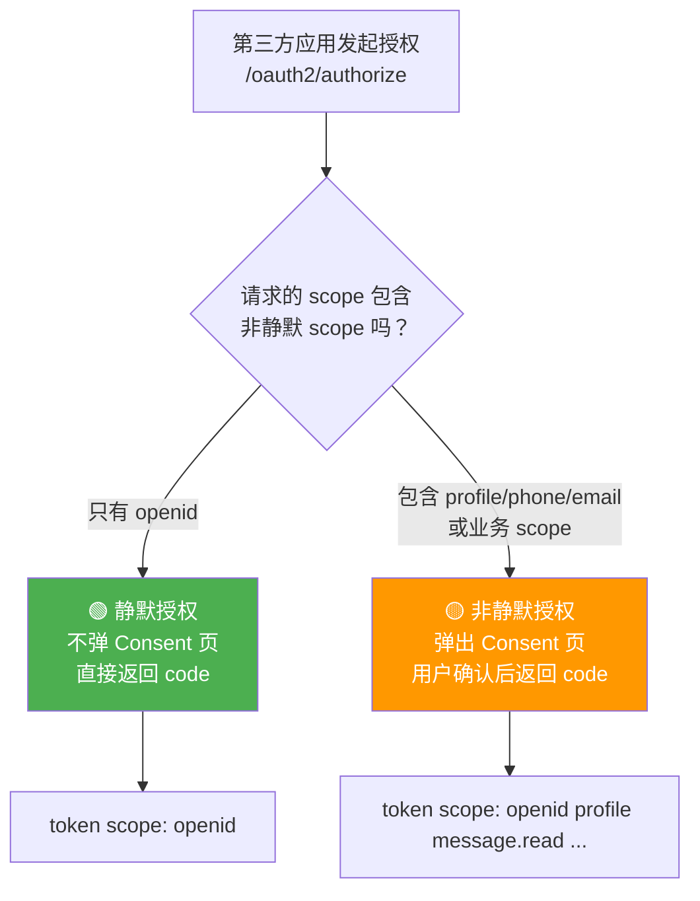

| 场景 | 请求 scope | 是否弹窗 | token 中获得 |
|------|-----------|----------|-------------|
| 静默识别用户 | `openid` | ❌ 不弹窗 | 仅 sub |
| 获取用户信息 | `openid profile` | ✅ 弹窗 | sub + 昵称 + 头像 |
| 获取手机号 | `openid phone` | ✅ 弹窗 | sub + 手机号 |
| 完整授权 | `openid profile phone message.read` | ✅ 弹窗 | 全部信息 + 业务权限 |

> **关键规则**：`openid` 是静默 scope，请求中**只有** `openid` 时不弹 Consent 页，直接返回授权码。只要包含任何非静默 scope，就必须弹 Consent 页。`openid` 在所有 authorization_code 流程中**自动包含**，无需显式请求。

#### 11.3.2 业务 API Scope（两种授权模式通用）

| 业务域 | Scope | 说明 | 映射 API 示例 | 典型使用者 |
|--------|-------|------|---------------|-----------|
| message | `message.read` | 读取消息列表、消息详情 | `GET /messages/**` | 消息聚合工具 |
| message | `message.write` | 发送消息、删除消息 | `POST /messages/send` | 自动回复机器人 |
| user | `user.read` | 读取用户详细资料 | `GET /user/**` | 用户画像分析 |
| user | `user.write` | 修改用户资料 | `PUT /user/**`, `PATCH /user/**` | 资料编辑工具 |
| order | `order.read` | 查询订单 | `GET /orders/**` | 订单追踪 |
| order | `order.write` | 创建/取消/修改订单 | `POST /orders`, `PUT /orders/**` | 代下单工具 |
| product | `product.read` | 查询商品 | `GET /products/**` | 比价工具 |
| product | `product.write` | 创建/修改/删除商品 | `POST /products`, `PUT /products/**` | 商品管理 |
| payment | `payment.read` | 查询支付记录 | `GET /payments/**` | 财务对账 |
| payment | `payment.write` | 发起支付、退款 | `POST /payments/charge` | 支付网关 |
| category | `category.read` | 查询分类（只读） | `GET /categories/**` | 分类浏览 |
| analytics | `analytics.read` | 查询分析数据（只读） | `GET /analytics/**` | 数据看板 |
| notification | `notification.read` | 读取通知 | `GET /notifications/**` | 通知聚合 |
| notification | `notification.write` | 发送通知、标记已读 | `POST /notifications/**` | 消息推送 |
| file | `file.read` | 下载文件 | `GET /files/**` | 文件预览 |
| file | `file.write` | 上传/删除文件 | `POST /files` | 云存储 |

### 11.4 Scope 分层模型（四层）

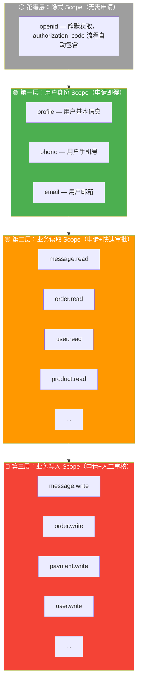

| 层级 | 审批要求 | 是否静默 | 典型场景 |
|------|----------|----------|----------|
| ⚪ 隐式 Scope | 无需申请，authorization_code 自动包含 | ✅ 静默 | 识别用户身份、自动登录 |
| 🟢 身份 Scope | 提交申请，自动审批 | ❌ 非静默 | 获取昵称头像、手机号 |
| 🟡 读取 Scope | 提交申请，自动或快速审批 | ❌ 非静默 | 数据查询、报表查看 |
| 🔴 写入 Scope | 提交申请，必须人工审核 | ❌ 非静默 | 数据修改、资金操作 |

### 11.5 两种授权模式下的 Scope 使用

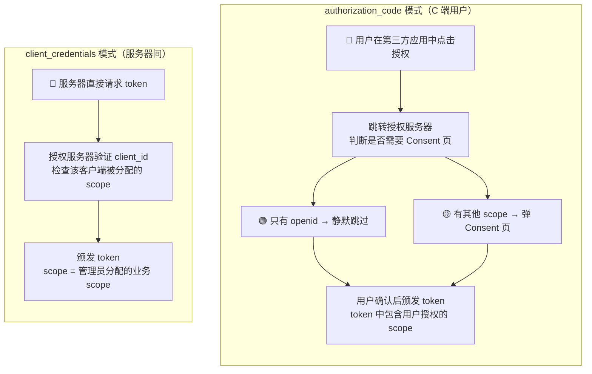

| 维度 | authorization_code | client_credentials |
|------|-------------------|-------------------|
| **适用场景** | 第三方应用代表用户操作 | 服务器间 API 调用 |
| **可用的身份 scope** | ✅ `openid`、`profile`、`phone`、`email` | ❌ 不适用（无用户） |
| **可用的业务 scope** | ✅ 用户 consent 确认的业务 scope | ✅ 管理员分配的业务 scope |
| **是否弹 Consent 页** | 取决于 scope 是否包含非静默 scope | 不需要 |
| **token 中的 sub** | 用户 ID | 客户端 ID |

### 11.6 Consent 页设计（借鉴抖音三状态）

当授权请求包含非静默 scope 时，弹出 Consent 页。参考抖音的三种权限勾选状态：

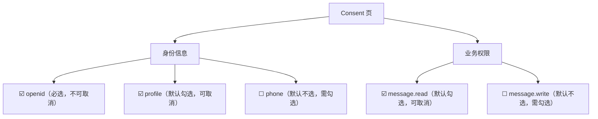

| 勾选状态 | 适用 scope | 用户体验 | 说明 |
|----------|-----------|----------|------|
| **必选，不可取消** | `openid` | 灰色勾选，不可操作 | 身份识别是最基础需求，必须授权 |
| **默认勾选，可取消** | `profile`、`*.read` | 勾选状态，可取消 | 重要但非必须，推荐授权 |
| **默认不选，需勾选** | `phone`、`email`、`*.write` | 未勾选状态，需主动勾选 | 敏感信息或写操作，需明确同意 |

### 11.7 Scope 与 API 的映射规则

#### 映射表设计（增强版）

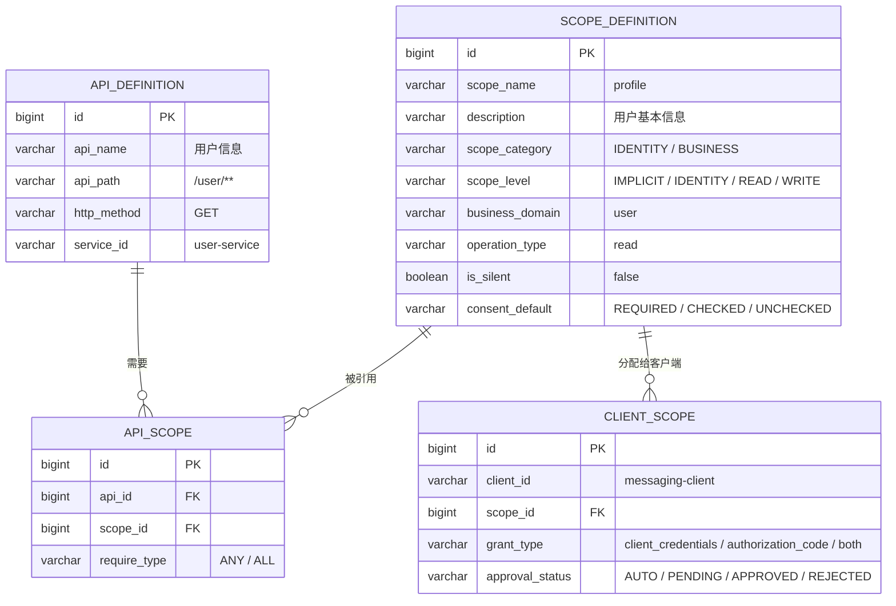

**关键改进**：

1. **`scope_definition` 增加 `scope_category`**：区分 `IDENTITY`（身份 scope）和 `BUSINESS`（业务 scope），两者规则完全不同
2. **`scope_definition` 增加 `is_silent`**：标记是否为静默 scope，授权服务器据此决定是否跳过 Consent 页
3. **`scope_definition` 增加 `consent_default`**：控制 Consent 页的默认勾选状态（借鉴抖音三状态）
4. **`client_scope` 增加 `approval_status`**：区分自动审批和人工审核
5. **`client_scope` 增加 `grant_type`**：`client_credentials` 模式下不能分配身份 scope

#### 映射示例

**scope_definition**

| id | scope_name | description | scope_category | scope_level | business_domain | operation_type | is_silent | consent_default |
|----|-----------|-------------|---------------|-------------|-----------------|---------------|-----------|----------------|
| 0 | openid | 用户唯一标识 | IDENTITY | IMPLICIT | - | - | true | REQUIRED |
| 1 | profile | 用户基本信息 | IDENTITY | IDENTITY | - | - | false | CHECKED |
| 2 | phone | 用户手机号 | IDENTITY | IDENTITY | - | - | false | UNCHECKED |
| 3 | email | 用户邮箱 | IDENTITY | IDENTITY | - | - | false | UNCHECKED |
| 4 | message.read | 读取消息 | BUSINESS | READ | message | read | false | CHECKED |
| 5 | message.write | 发送/删除消息 | BUSINESS | WRITE | message | write | false | UNCHECKED |
| 6 | user.read | 读取用户详情 | BUSINESS | READ | user | read | false | CHECKED |
| 7 | user.write | 修改用户信息 | BUSINESS | WRITE | user | write | false | UNCHECKED |
| 8 | order.read | 查询订单 | BUSINESS | READ | order | read | false | CHECKED |
| 9 | order.write | 创建/取消订单 | BUSINESS | WRITE | order | write | false | UNCHECKED |

**api_definition**

| id | api_name | api_path | http_method | service_id |
|----|----------|----------|-------------|------------|
| 1 | 用户身份 | /userinfo | GET | user-service |
| 2 | 用户手机号 | /user/phone | GET | user-service |
| 3 | 用户邮箱 | /user/email | GET | user-service |
| 4 | 消息列表 | /messages/** | GET | message-service |
| 5 | 发送消息 | /messages/send | POST | message-service |
| 6 | 删除消息 | /messages/*/delete | POST | message-service |

**api_scope**

| id | api_id | scope_id | require_type | 说明 |
|----|--------|----------|-------------|------|
| 1 | 1 | 0 | ALL | /userinfo 至少需要 openid |
| 2 | 1 | 1 | ANY | 有 profile 则返回更多信息 |
| 3 | 2 | 2 | ALL | 手机号必须 phone scope |
| 4 | 3 | 3 | ALL | 邮箱必须 email scope |
| 5 | 4 | 4 | ALL | |
| 6 | 5 | 5 | ALL | |
| 7 | 6 | 5 | ALL | |

### 11.8 Scope 校验规则

#### 网关校验逻辑（伪代码）

```java
// 网关 ScopeAuthorizationFilter 核心逻辑
public boolean checkScope(HttpServletRequest request, Jwt jwt) {
    // 1. 提取请求信息
    String path = request.getRequestURI();      // /messages/send
    String method = request.getMethod();         // POST

    // 2. 查 API Market：该 API 需要什么 scope
    List<ScopeRequirement> requirements = apiMarketService.getRequiredScopes(path, method);
    // → [{scope: "message.write", requireType: "ALL"}]

    // 3. 如果没有 scope 要求，直接放行
    if (requirements.isEmpty()) {
        return true;
    }

    // 4. 提取 token 中的 scope
    Set<String> tokenScopes = jwt.getClaimAsStringList("scope");
    // → ["openid", "profile", "message.read"]

    // 5. 按组校验
    // ALL 组：token 必须包含全部
    // ANY 组：token 包含任一即可
    return matchScopes(tokenScopes, requirements);
}
```

#### 授权服务器静默判断逻辑（伪代码）

```java
// 授权服务器判断是否需要弹出 Consent 页
public boolean requiresConsent(Set<String> requestedScopes) {
    // openid 是隐式 scope，自动包含
    // 只有 openid → 静默，不需要 Consent
    Set<String> nonImplicitScopes = requestedScopes.stream()
        .filter(s -> !s.equals("openid"))
        .collect(Collectors.toSet());

    return !nonImplicitScopes.isEmpty();
}
```

#### 校验规则明细

| 规则 | 说明 | 示例 |
|------|------|------|
| **静默判断** | 只有 `openid` 时不弹 Consent，直接返回 code | scope=`openid` → 静默 |
| **非静默判断** | 包含任何非 `openid` 的 scope 时弹 Consent | scope=`openid profile` → 弹窗 |
| **openid 自动包含** | authorization_code 流程中 `openid` 始终在 token 中 | 即使不显式请求也会包含 |
| **read 不包含 write** | `message.read` 只能访问 GET 接口 | `message.read` 不能 POST /messages/send |
| **write 不包含 read** | `message.write` 只能访问写接口 | `message.write` 不能 GET /messages |
| **身份 scope 仅限 authorization_code** | client_credentials 模式不能申请 `profile`、`phone`、`email` | 服务器间调用无用户概念 |
| **openid 无业务权限** | `openid` 只能访问 /userinfo（仅 sub） | `openid` 不能访问 /messages |
| **未配置 scope 的 API 直接放行** | 如果 API Market 没有该 API 的 scope 配置 | 公开接口无需 scope |

### 11.9 完整授权流程时序图（含静默/非静默）

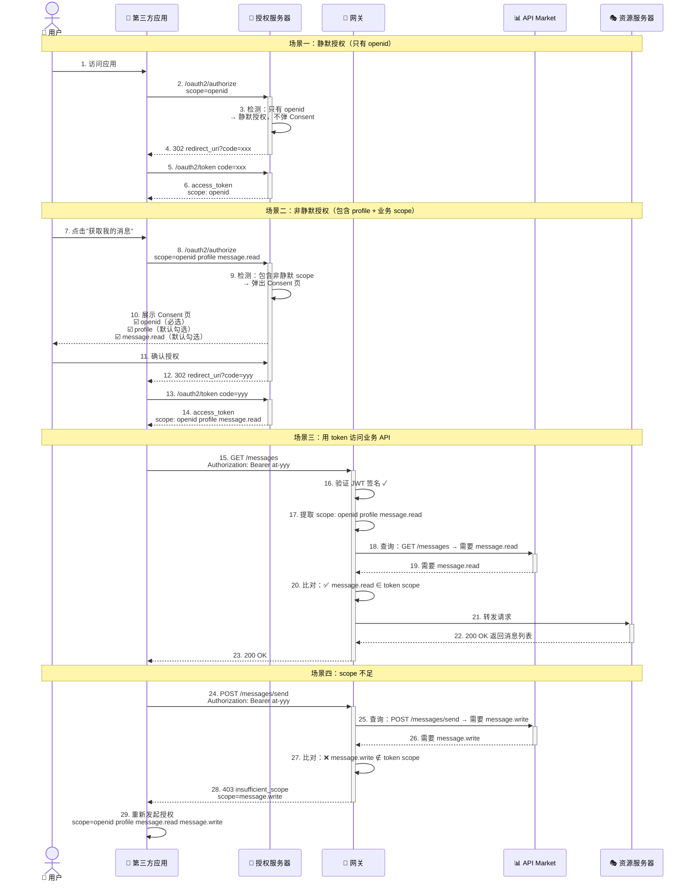

### 11.10 客户端 Scope 申请与审批流程

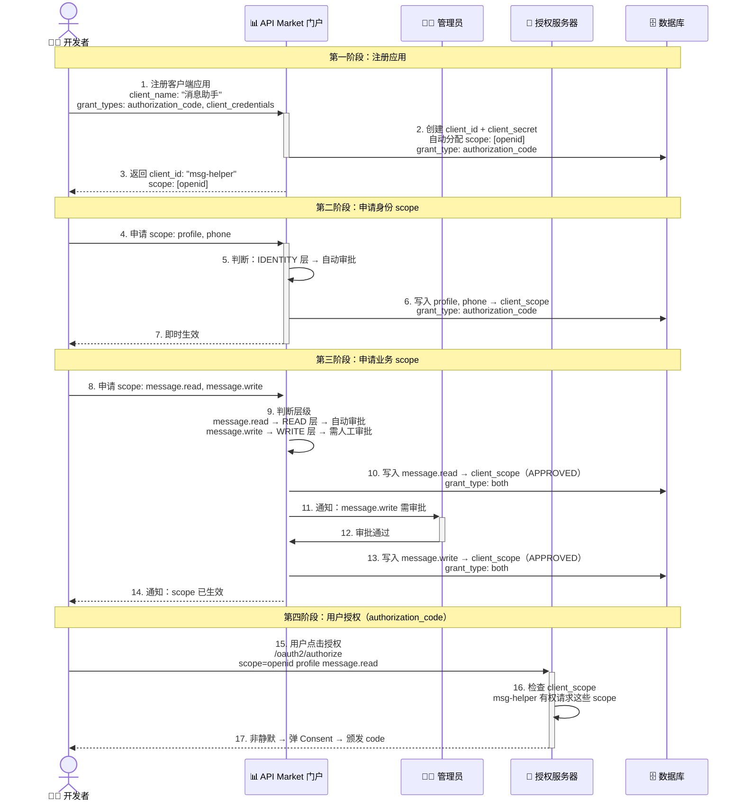

### 11.11 Scope 扩展性设计

#### 新增业务域

```
新增业务域只需 3 步：

1. API Market 管理后台新增 scope_definition：
   INSERT INTO scope_definition (scope_name, description, scope_category, scope_level, business_domain, operation_type, is_silent, consent_default)
   VALUES ('inventory.read', '读取库存', 'BUSINESS', 'READ', 'inventory', 'read', false, 'CHECKED'),
          ('inventory.write', '管理库存', 'BUSINESS', 'WRITE', 'inventory', 'write', false, 'UNCHECKED');

2. 为新 API 配置 scope 映射：
   INSERT INTO api_scope (api_id, scope_id) VALUES (新API_id, inventory.read_id);

3. 网关自动感知变更（通过消息总线刷新缓存）
   → 资源服务器零改动
```

#### Scope 版本化

```
当 API 发生不兼容变更时，支持 scope 版本化：

v1 阶段：order.read, order.write
v2 阶段：order.read, order.write, order.v2.read, order.v2.write

- 旧客户端继续使用 v1 scope
- 新客户端申请 v2 scope
- 渐进式迁移，无强制切换
```

### 11.12 安全最佳实践

| 实践 | 说明 |
|------|------|
| **最小权限原则** | 客户端默认只有 `openid`，按需申请身份和业务 scope |
| **静默 scope 仅限 openid** | 只有 `openid` 可以静默授权，其他所有 scope 必须用户确认 |
| **write scope 需人工审核** | 所有 `.write` scope 必须人工审核，防止误操作 |
| **身份 scope 仅限 authorization_code** | `profile`、`phone`、`email` 不能分配给 client_credentials 模式 |
| **敏感信息默认不选** | `phone`、`email` 在 Consent 页默认不勾选，用户需主动勾选 |
| **定期审计** | 管理后台展示"scope 使用统计"，识别异常调用 |
| **scope 不可超出** | token 中的 scope 只能是 client_scope 的子集 |
| **拒绝通配 scope** | 不允许 `*`、`all` 等通配 scope |
| **敏感操作二次确认** | `payment.write` 等高危 scope 在 Consent 页强制展示 |

### 11.13 与各平台方案的对比总结

| 设计维度 | 本方案 | 微信 | 支付宝 | 京东 | 抖音 |
|----------|--------|------|--------|------|------|
| 静默授权 | ✅ `openid` | ✅ `snsapi_base` | ✅ `auth_base` | ❌ | ❌ |
| 非静默用户信息 | `profile` | `snsapi_userinfo` | `auth_user` | ❌ | `user_info` |
| 命名格式 | 身份: 单词<br/>业务: `域.操作` | `前缀_功能` | `前缀_功能` | `域.操作` | 混合 |
| 读写分离 | ✅ 业务 scope | ❌ | ❌ | ✅ | ❌ |
| 分层审批 | ✅ 四层 | ❌ | ❌ | ❌ | ✅ 三状态 |
| Consent 勾选状态 | ✅ 三状态 | ❌ | ❌ | ❌ | ✅ |
| scope 与 API 映射 | ✅ 数据库配置 | N/A | N/A | 硬编码 | 能力管理 |

**一句话总结**：To C 平台 scope 设计 = 微信/支付宝的「`openid` 静默 / `profile` 非静默」用户身份层 + 京东的「`业务域.read`/`业务域.write`」业务 API 层 + 抖音的「必选/默认勾选/默认不选」Consent 体验，四层审批（隐式→身份→读取→写入），身份 scope 仅限 authorization_code，业务 scope 两种模式通用。
