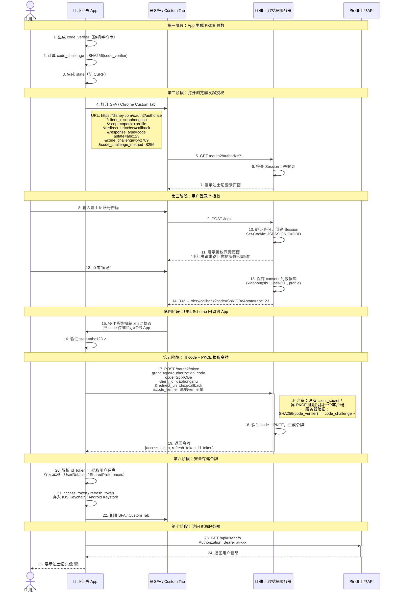
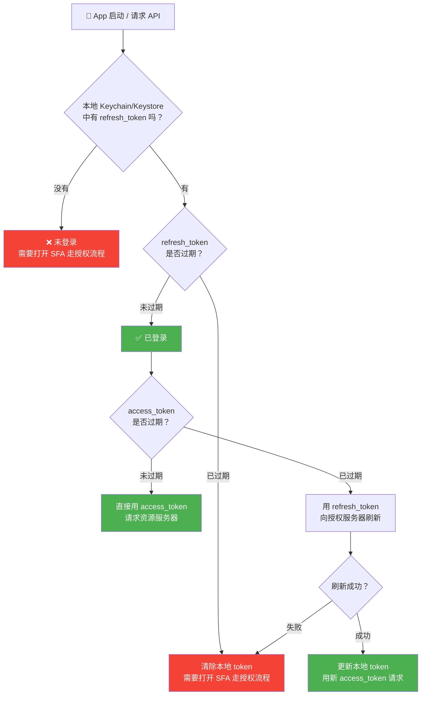
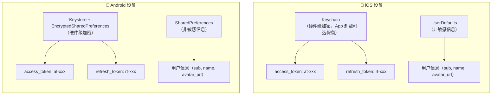
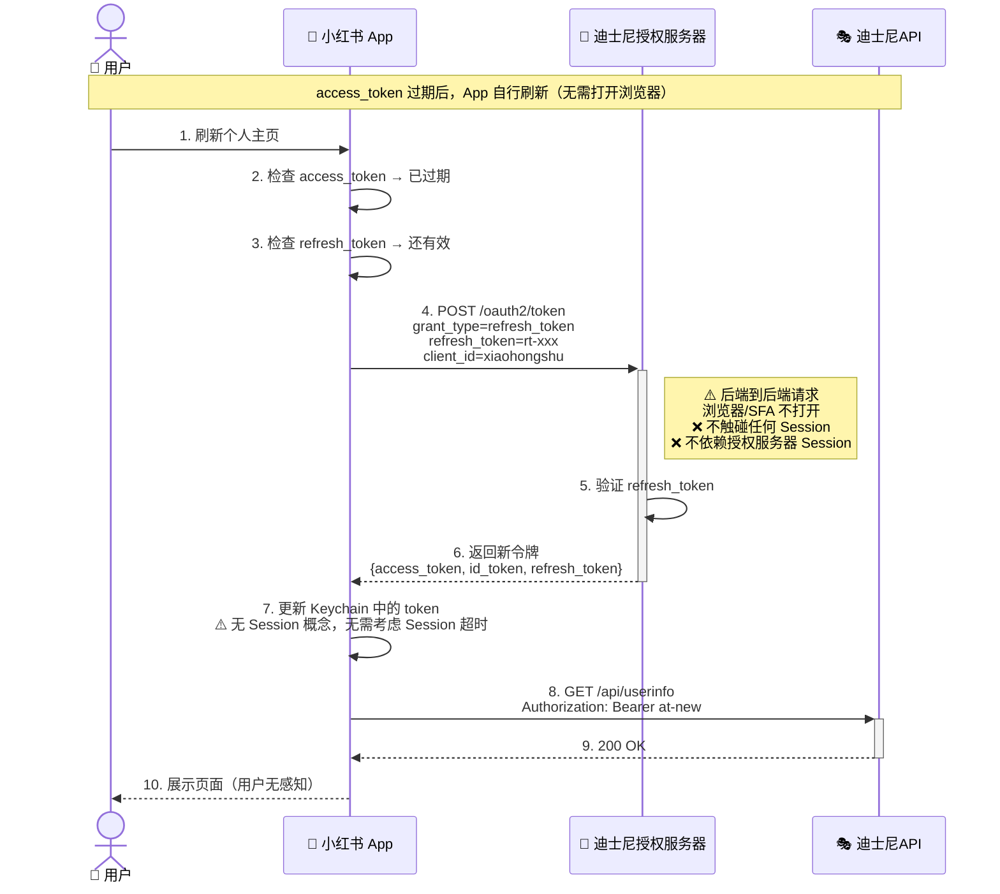
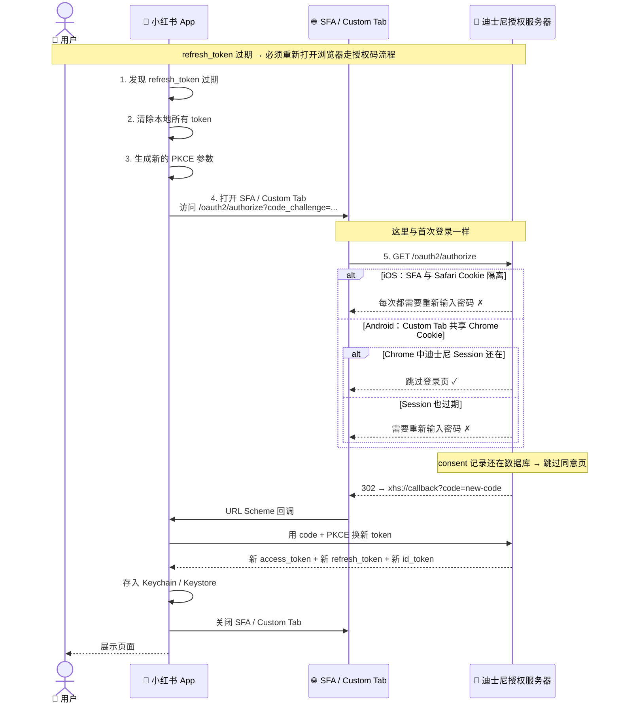
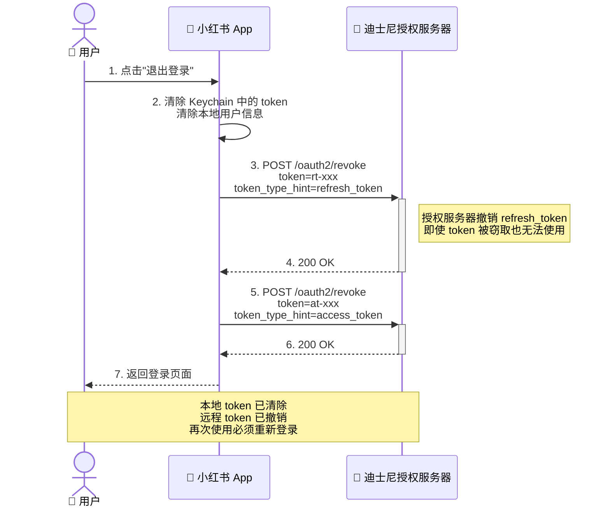
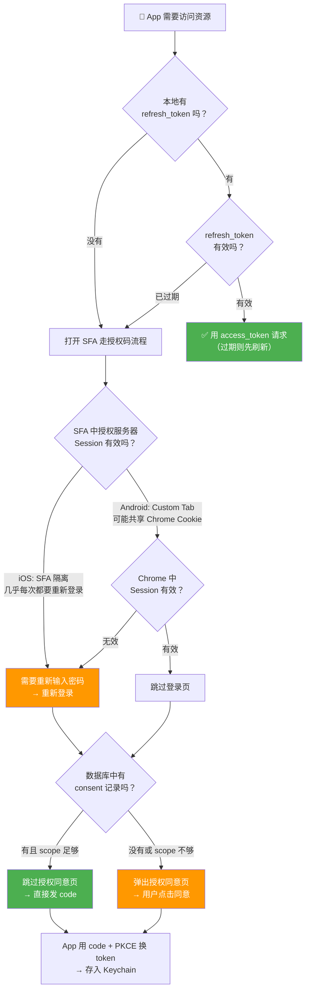

# OIDC 原生 App 授权登录流程图解

场景：小红书是一个原生 App（iOS/Android），没有 Session/Cookie 机制，用户用迪士尼账户登录后访问迪士尼 API 拿到头像。

---

## 一、Web vs App 核心差异

```mermaid
flowchart LR
    subgraph Web["🌐 Web 客户端"]
        direction TB
        W1["登录态 = Session (JSESSIONID)"]
        W2["Token 存储 = HttpSession"]
        W3["回调方式 = 浏览器 302 重定向"]
        W4["安全措施 = client_secret"]
        W5["无感续期 = 依赖授权服务器 Session"]
    end

    subgraph App["📱 App 客户端"]
        direction TB
        A1["登录态 = refresh_token（本地安全存储）"]
        A2["Token 存储 = Keychain / Keystore"]
        A3["回调方式 = URL Scheme / Universal Link"]
        A4["安全措施 = PKCE（无法安全保管 client_secret）"]
        A5["无感续期 = refresh_token 有效即可刷新"]
    end

    Web -.->|完全不同的机制| App
```



| | Web 客户端 | App 客户端 |
|---|---|---|
| **登录态载体** | Session (JSESSIONID) | 本地存储的 refresh_token |
| **Token 存储** | HttpSession（服务端内存） | Keychain/Keystore（设备安全存储） |
| **用户信息** | OidcUser 存 Session | id_token 解析后存 App 本地 |
| **授权码回调** | 浏览器 302 重定向 | URL Scheme（如 `xhs://callback?code=xxx`） |
| **安全措施** | client_secret（服务端保管） | PKCE（App 无法安全保管 client_secret） |
| **无感续期** | 授权服务器 Session 还在 → 无感重走授权码流程 | refresh_token 有效 → 直接刷新，不依赖授权服务器 Session |
| **登出** | 清除两端 Session | 删除本地 token + 调授权服务器 revoke 端点 |

---

## 二、App 端 OIDC 授权码 + PKCE 流程



### PKCE 为什么替代了 client_secret

```
Web：client_secret 存在服务器 → 安全 ✓
App：client_secret 编译在 APK/IPA 里 → 可被反编译 → 不安全 ✗

PKCE 方案：
1. App 生成随机 code_verifier（只有 App 自己知道）
2. App 发送 code_challenge = SHA256(code_verifier) 给授权服务器
3. 授权服务器把 code_challenge 绑定到 authorization_code
4. App 用 code 换 token 时，必须提供原始 code_verifier
5. 授权服务器验证：SHA256(code_verifier) == code_challenge → ✓

→ 截获 code 的人没有 code_verifier → 无法换 token
→ 不需要 client_secret，安全性由 PKCE 保证
```

---

## 三、App 端登录态管理



### 关键区别：App 的登录态 = refresh_token

| | Web | App |
|---|---|---|
| **判断"是否已登录"** | Session 中有无 SecurityContext | 本地有无未过期的 refresh_token |
| **判断"是否需要重新输入密码"** | 授权服务器 Session 是否过期 | refresh_token 是否过期 |
| **判断"是否需要重新授权同意"** | 数据库中有无 consent 记录 | 数据库中有无 consent 记录（一样） |
| **无感续期条件** | 授权服务器 Session 还在 + consent 还在 | refresh_token 还有效（**不依赖**授权服务器 Session） |

**App 实际上体验更好：** Web 的"无感续期"必须依赖授权服务器 Session 还在。但 App 只需要 refresh_token 有效就能刷新，完全不依赖授权服务器的 Session。

```
Web：客户端 Session 过期 → 必须找授权服务器 → 授权服务器 Session 也过期就完了 → 要重新输入密码
App：不需要 Session → refresh_token 有效就能刷 → 完全不依赖授权服务器 Session
```

---

## 四、App 端 Token 存储结构



### 与 Web 端存储的对比

| | Web（HttpSession） | App（本地安全存储） |
|---|---|---|
| access_token | HttpSession → OAuth2AuthorizedClient | Keychain / Keystore |
| refresh_token | HttpSession → OAuth2AuthorizedClient | Keychain / Keystore |
| 用户信息 | HttpSession → SecurityContext → OidcUser | UserDefaults / SharedPreferences |
| 索引 | JSESSIONID（Cookie） | 无需索引，直接读取 |
| 丢失条件 | JSESSIONID 被删 / Session 超时 | App 卸载 / 用户清除数据 / refresh_token 过期 |
| 跨设备 | 不跨设备（Cookie 绑定浏览器） | 不跨设备（Keychain 绑定设备） |

---

## 五、App 端 Token 刷新流程



### App 刷新 vs Web 刷新的核心差异

```
Web 刷新 access_token：
├─ 刷新本身：后端到后端，不碰 Session ✓
├─ 但如果 refresh_token 也过期 → 必须走授权码流程
├─ 走授权码流程 → 需要浏览器 → 需要授权服务器 Session
└─ 授权服务器 Session 也过期 → 必须重新输入密码 ✗

App 刷新 access_token：
├─ 刷新本身：后端到后端，不需要 Session ✓
├─ 如果 refresh_token 也过期 → 必须走授权码流程
├─ 走授权码流程 → 需要打开 SFA
└─ SFA 与 Safari Cookie 隔离（iOS）→ 几乎每次都要重新输入密码 ✗
    Chrome Custom Tab 共享 Cookie（Android）→ 可能跳过登录 ✓
```

---

## 六、App 端 refresh_token 过期后的流程



### 授权服务器的 Session 依然存在

**重要：App 场景下，授权服务器仍然会创建 Session。** 从授权服务器的角度看，SFA/Custom Tab 就是浏览器。它处理 `/oauth2/authorize` 请求时，如果用户未登录，会正常创建 Session 并通过 `Set-Cookie: JSESSIONID=DDD` 返回。授权服务器根本不知道对面是 Web 浏览器还是 App 打开的 SFA。

**问题不在于"授权服务器有没有 Session"，而在于"下次打开 SFA 时能不能找到这个 Session"：**

| 平台 | SFA 关闭后 JSESSIONID | 授权服务器 Session | 下次打开 SFA |
|------|----------------------|-------------------|-------------|
| iOS SFA | **丢失**（Cookie 隔离，每次全新） | **还在内存中**（但找不到了） | 新的 JSESSIONID → 找不到旧 Session → 重新登录 |
| Android Custom Tab | **可能保留**（共享 Chrome Cookie） | **还在内存中** | 带 JSESSIONID → 找到 Session → 跳过登录 |
| Web 浏览器 | **保留**（Cookie 持久化） | **还在内存中** | 带 JSESSIONID → 找到 Session → 跳过登录 |

```
授权服务器视角（不区分 Web / App）：

收到 /oauth2/authorize 请求
  ├── 有 JSESSIONID 且 Session 有效 → 已登录，跳过登录页
  └── 无 JSESSIONID 或 Session 过期 → 未登录，展示登录页

至于 JSESSIONID 为什么没带过来，授权服务器不关心，也不需要关心。
```

### iOS SFA 的 Cookie 隔离问题

```
SFA (SafariViewController) 的 Cookie 隔离：

Safari 浏览器中的 Cookie：
  disney.com → JSESSIONID=DDD  ← 这是 Safari 的

SFA 中的 Cookie：
  disney.com → (空)            ← 每次打开 SFA 都是全新环境

结果：即使用户在 Safari 中已登录迪士尼，SFA 中也不共享登录态
      → App 每次打开 SFA 都需要重新输入密码
      → 授权服务器 Session 还在，但 SFA 没有 JSESSIONID 去找它

Android Chrome Custom Tab：
  共享 Chrome 的 Cookie → 如果 Chrome 中已登录，Custom Tab 也已登录
  → App 打开 Custom Tab 可能跳过登录页
  → 授权服务器 Session 还在，Custom Tab 有 JSESSIONID 能找到它
```

**一句话：授权服务器 Session 始终存在，但 iOS SFA 的 Cookie 不持久，导致下次找不到这个 Session。**

**这就是为什么 App 的策略是：用 refresh_token 长期维持登录态，尽量少打开 SFA。**

---

## 七、App 端登出流程



### App 登出 vs Web 登出

| | Web 登出 | App 登出 |
|---|---|---|
| **清除本地登录态** | 删除 JSESSIONID（清 Session） | 删除 Keychain 中的 token |
| **通知授权服务器** | RP-Initiated Logout（浏览器跳转） | Token Revocation（后端请求） |
| **清除授权服务器 Session** | 直接清除（浏览器带 JSESSIONID） | App 不持有 JSESSIONID，无法清除 |
| **效果** | 两端 Session 都清了 | 本地 token 清了 + 远程 token 撤销了 |
| **残留** | 无 | 授权服务器 Session 可能还在（但没危害） |

---

## 八、App 端何时需要重新登录 / 重新授权



### App 的四种场景（与 Web 对比）

| 场景 | Web | App |
|------|-----|-----|
| **无需重新登录，无需重新授权** | 授权服务器 Session 在 + consent 在 | refresh_token 有效 → 直接刷新（**更简单**） |
| **需要重新登录，无需重新授权** | 授权服务器 Session 过期 + consent 在 | refresh_token 过期 → 打开 SFA → 输入密码 + 跳过同意 |
| **无需重新登录，需要重新授权** | 授权服务器 Session 在 + consent 没了 | App 中不存在（打开 SFA 就是新的授权流程） |
| **需要重新登录，需要重新授权** | 两边都没了 | refresh_token 过期 + consent 被删 → 全部重来 |

---

## 九、App 端 refresh_token 有效期建议

### 关键原则：refresh_token 越长，打开 SFA 的频率越低

```
refresh_token 短（如 1 小时）：
  用户 1 小时不用 App → refresh_token 过期 → 必须打开 SFA
  iOS 用户 → 每次都要重新输入密码 → 体验差 ✗

refresh_token 长（如 30 天）：
  用户 30 天内打开 App → refresh_token 还有效 → 无感刷新
  不需要打开 SFA → 体验好 ✓
  安全风险：token 被窃取后 30 天内都可用 → 需要额外措施
```

### 三种典型配置方案

**方案1：高安全场景（金融、支付）**

| | refresh_token | access_token | 额外措施 |
|---|---|---|---|
| 有效期 | 2~24 小时 | 5 分钟 | 设备绑定 + 生物识别解锁 |
| 特点 | 短有效期，减少被盗用风险 | | 每次打开 App 需要指纹/面容 |

**方案2：常规场景（大多数 App）**

| | refresh_token | access_token | 额外措施 |
|---|---|---|---|
| 有效期 | 7~30 天 | 5~30 分钟 | 可选生物识别 |
| 特点 | 平衡安全与体验，减少 SFA 打开次数 | | 偶尔需要重新登录 |

**方案3：高便利场景（社交、内容平台）**

| | refresh_token | access_token | 额外措施 |
|---|---|---|---|
| 有效期 | 30~90 天 | 1~2 小时 | 无 |
| 特点 | 用户几乎不需要重新登录 | | access_token 较长，减少刷新频率 |

### 与 Web 端配置的核心区别

```
Web 端：关键配置是两端的 Session 超时（授权服务器 Session ≥ 客户端 Session）
App 端：关键配置是 refresh_token 有效期（越长体验越好，但安全风险越高）

Web 端的 Session 超时对 App 没有直接影响：
  App 不持有 JSESSIONID → 授权服务器 Session 过不过期与 App 无关
  App 靠 refresh_token 维持 → refresh_token 有效期才是 App 的"Session"
```

---

## 十、核心结论（App 篇）

1. **App 没有 Session，登录态 = refresh_token**，存放在设备安全存储（Keychain/Keystore）中
2. **App 必须使用 PKCE** 代替 client_secret，因为 App 无法安全保管 client_secret
3. **App 回调用 URL Scheme**（`xhs://callback`），不是浏览器的 302 重定向
4. **App 的无感续期更优**：refresh_token 有效就能刷新，不依赖授权服务器 Session
5. **iOS SFA 与 Safari Cookie 隔离**，每次打开 SFA 几乎都需要重新输入密码，所以要尽量少打开 SFA
6. **Android Chrome Custom Tab 共享 Cookie**，可能跳过登录页
7. **App 策略：用长有效期 refresh_token 维持登录态，尽量少打开浏览器**
8. **App 登出 = 删除本地 token + 调 revoke 端点撤销远程 token**，不同于 Web 的 RP-Initiated Logout
9. **Web 的 Session 超时配置对 App 无直接影响**，App 的"Session"就是 refresh_token 的有效期
10. **三个 Token 在 App 中存 Keychain/Keystore**（Web 中存在 HttpSession），丢失条件从"JSESSIONID 被删"变为"App 卸载 / 用户清除数据 / refresh_token 过期"
