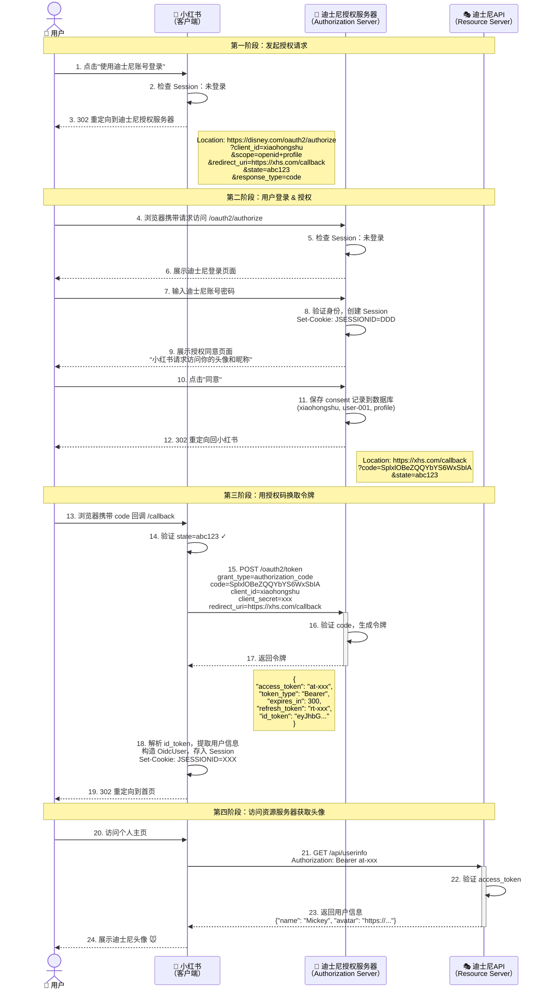
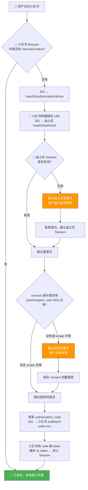
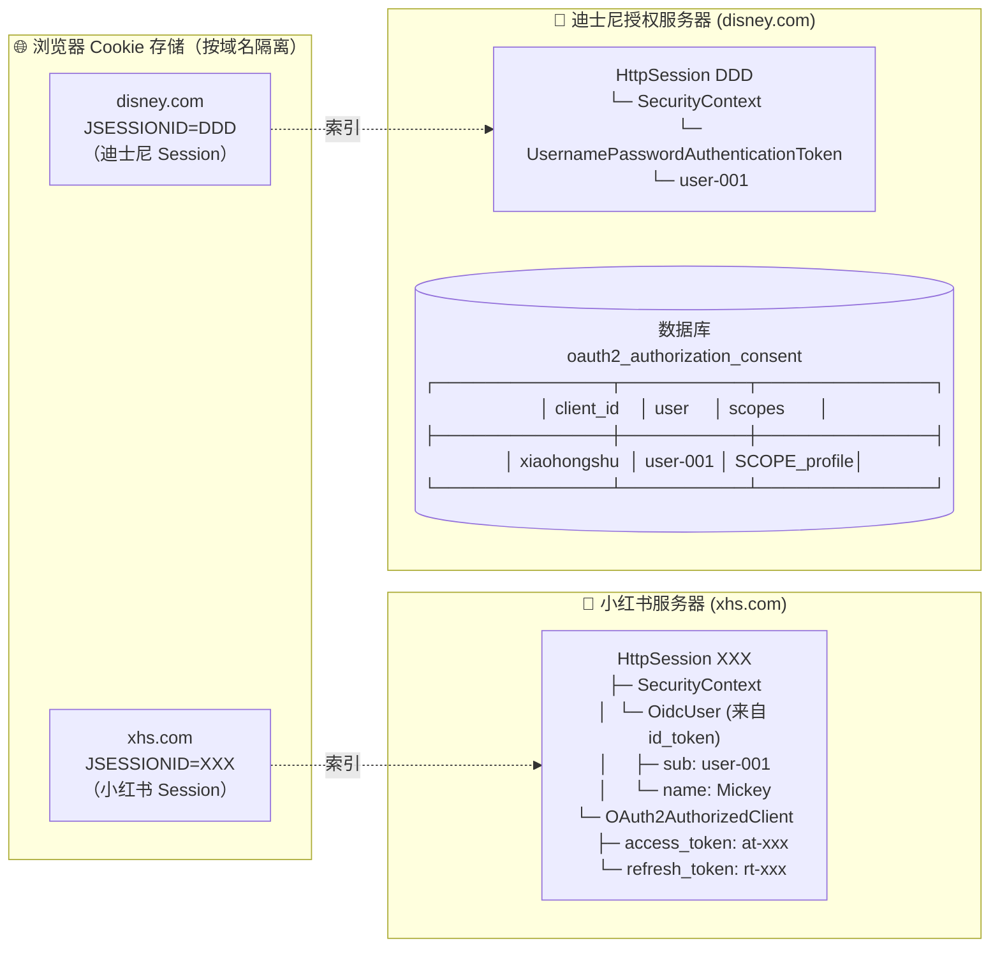
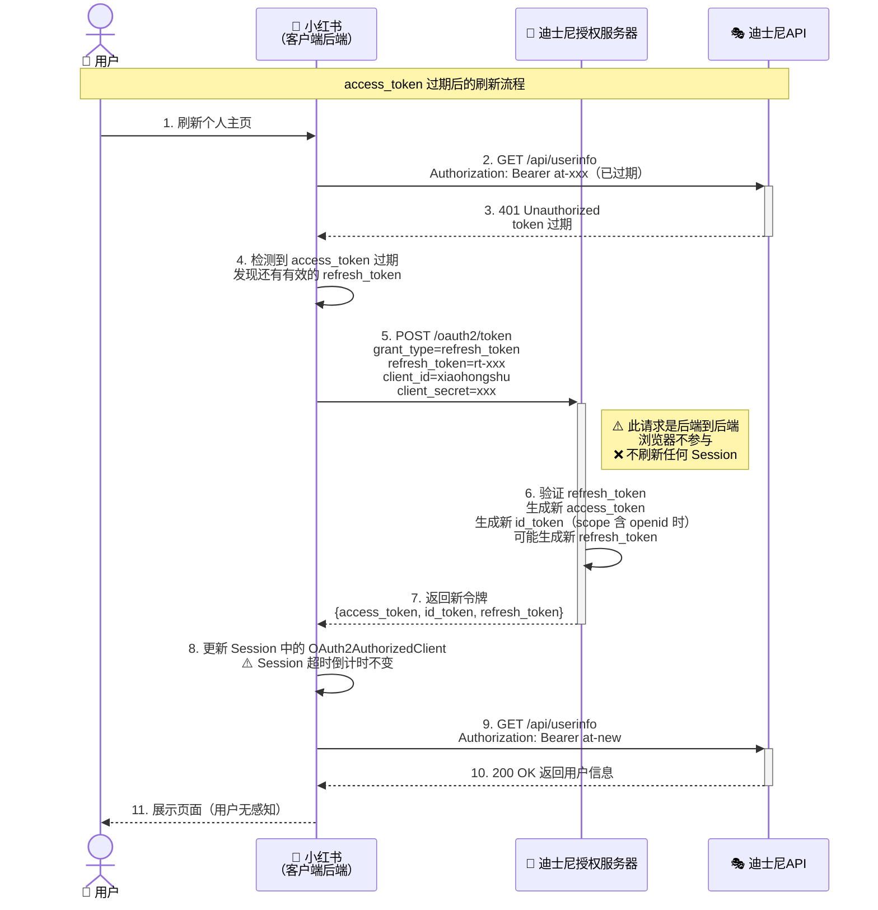
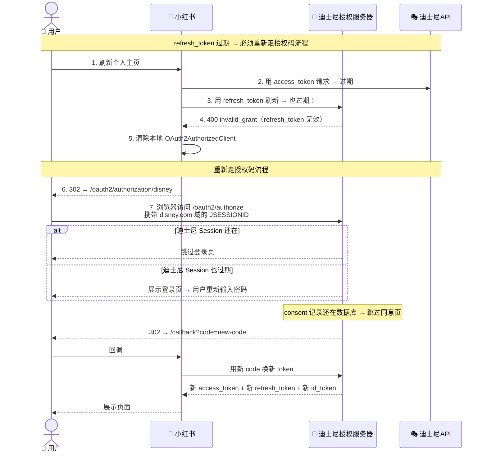
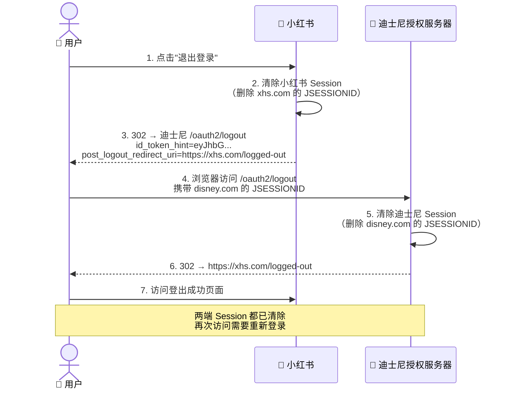
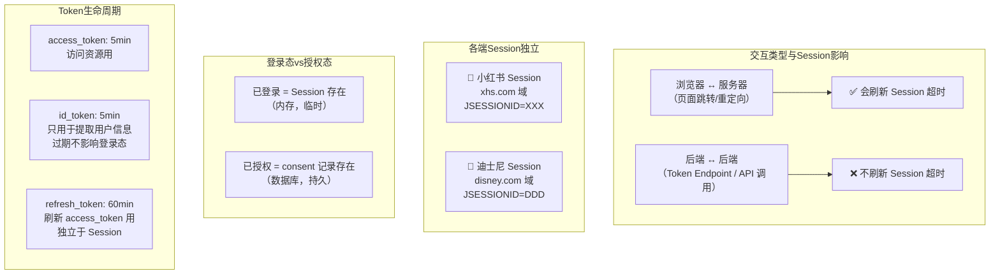

# OIDC 授权登录流程图解

场景：用户在小红书点击"迪士尼登录"，完成授权后访问迪士尼 API 拿到头像。

---

## 一、完整 OIDC 授权码流程（时序图）

---

## 二、登录态判断流程（流程图）

---

## 三、Cookie / Session 分布图

---

## 四、Token 刷新流程

---

## 五、refresh_token 也过期后的完整流程

---

## 六、登出流程

---

## 七、核心交互总结

