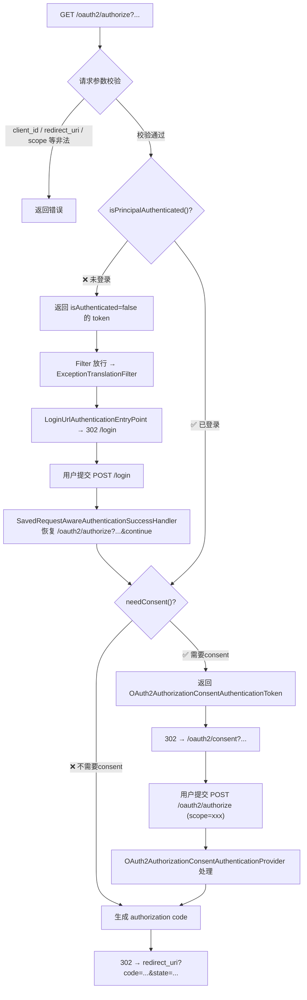

# 不同场景下的 API 列表与流程

## 场景概览

授权服务器收到 `GET /oauth2/authorize?...` 后，核心决策逻辑位于 `OAuth2AuthorizationCodeRequestAuthenticationProvider`，由两个关键判断决定走向：

1. **`isPrincipalAuthenticated()`** — 当前用户是否已登录
2. **`needConsent()`** — 当前 client + scopes 是否需要用户确认授权

由此产生四种组合：

| 场景 | 是否已登录 | 是否已授权(consent) | 需要登录 | 需要consent | 步骤数 |
|------|-----------|-------------------|---------|------------|-------|
| ① 未登录未授权 | ❌ | ❌ | ✅ | ✅ | 11 |
| ② 已登录已授权 | ✅ | ✅ | ❌ | ❌ | 6 |
| ③ 未登录已授权 | ✅(登录后) | ✅ | ✅ | ❌ | 8 |
| ④ 已登录未授权 | ✅ | ❌ | ❌ | ✅ | 8 |

---

## 场景①：未登录 + 未授权（完整流程）

最完整的流程，包含登录和 consent 两个阶段。

### 流程图

```
Browser                  demo-client:8080              authorization-server:9000
  │                           │                              │
  │── GET / ─────────────────>│                              │
  │<─ 302 /oauth2/authorization/messaging-client-oidc ──────│
  │                           │                              │
  │── GET /oauth2/authorization/messaging-client-oidc ──────>│
  │<─ 302 /oauth2/authorize?... ────────────────────────────│
  │                           │                              │
  │── GET /oauth2/authorize?... ────────────────────────────>│
  │                           │   用户未登录,保存请求到Session  │
  │<─ 302 /login ───────────────────────────────────────────│
  │                           │                              │
  │── GET /login ───────────────────────────────────────────>│
  │<─ 200 login.html ───────────────────────────────────────│
  │                           │                              │
  │── POST /login (user1/password) ─────────────────────────>│
  │                           │   登录成功,恢复SavedRequest    │
  │<─ 302 /oauth2/authorize?...&continue ───────────────────│
  │                           │                              │
  │── GET /oauth2/authorize?...&continue ───────────────────>│
  │                           │   已登录,需要consent           │
  │<─ 302 /oauth2/consent?... ──────────────────────────────│
  │                           │                              │
  │── GET /oauth2/consent?... ──────────────────────────────>│
  │<─ 200 consent.html ─────────────────────────────────────│
  │                           │                              │
  │── POST /oauth2/authorize (scope=profile) ───────────────>│
  │                           │   consent通过,生成code         │
  │<─ 302 redirect_uri?code=...&state=... ──────────────────│
  │                           │                              │
  │── GET /login/oauth2/code/...?code=...&state=... ───────>│
  │   [客户端内部: code→token, 校验id_token, 建立会话]         │
  │<─ 302 /?continue ───────────────────────────────────────│
  │                           │                              │
  │── GET /?continue ────────>│                              │
  │<─ 302 /index ─────────────│                              │
  │                           │                              │
  │── GET /index ────────────>│                              │
  │<─ 200 index.html ─────────│                              │
```

### API 列表

| # | 请求 | 响应 | 说明 |
|---|------|------|------|
| 1 | `GET http://127.0.0.1:8080/` | `302` → `/oauth2/authorization/messaging-client-oidc` | 未认证，触发 OAuth2 登录 |
| 2 | `GET http://127.0.0.1:8080/oauth2/authorization/messaging-client-oidc` | `302` → `/oauth2/authorize?...` | 客户端构建授权请求 |
| 3 | `GET http://localhost:9000/oauth2/authorize?...` | `302` → `/login` | 授权服务器发现未登录 |
| 4 | `GET http://localhost:9000/login` | `200` login.html | 渲染登录页面 |
| 5 | `POST http://localhost:9000/login` | `302` → `/oauth2/authorize?...&continue` | 提交用户名密码，登录成功 |
| 6 | `GET http://localhost:9000/oauth2/authorize?...&continue` | `302` → `/oauth2/consent?...` | 已登录但需要 consent |
| 7 | `GET http://localhost:9000/oauth2/consent?...` | `200` consent.html | 渲染授权确认页面 |
| 8 | `POST http://localhost:9000/oauth2/authorize` | `302` → `redirect_uri?code=...` | 提交 consent，签发 code |
| 9 | `GET http://127.0.0.1:8080/login/oauth2/code/...?code=...&state=...` | `302` → `/?continue` | 客户端处理回调（内部换 token） |
| 10 | `GET http://127.0.0.1:8080/?continue` | `302` → `/index` | 恢复原始请求 |
| 11 | `GET http://127.0.0.1:8080/index` | `200` index.html | 最终页面 |

### 涉及的核心组件

| 组件 | 所在端 | 作用 |
|------|--------|------|
| `AuthorizationFilter` | 客户端 | 判断未认证，触发登录 |
| `OAuth2AuthorizationRequestRedirectFilter` | 客户端 | 构建并重定向到授权请求 |
| `OAuth2AuthorizationEndpointFilter` | 授权服务器 | 拦截 `/oauth2/authorize` |
| `OAuth2AuthorizationCodeRequestAuthenticationProvider` | 授权服务器 | 核心决策：未登录 → 返回未认证 token |
| `LoginUrlAuthenticationEntryPoint` | 授权服务器 | 未认证时重定向到 `/login` |
| `HttpSessionRequestCache` | 授权服务器 | 保存原始授权请求 |
| `UsernamePasswordAuthenticationFilter` | 授权服务器 | 处理表单登录 |
| `SavedRequestAwareAuthenticationSuccessHandler` | 授权服务器 | 登录成功后恢复原始请求 |
| `OAuth2AuthorizationCodeRequestAuthenticationProvider` | 授权服务器 | 已登录但需要 consent → 返回 ConsentAuthToken |
| `AuthorizationConsentController` | 授权服务器 | 渲染 consent 页面 |
| `OAuth2AuthorizationConsentAuthenticationProvider` | 授权服务器 | 处理 consent 提交，生成 code |
| `OAuth2LoginAuthenticationFilter` | 客户端 | 处理回调，换 token |
| `SavedRequestAwareAuthenticationSuccessHandler` | 客户端 | 恢复客户端原始请求 |

---

## 场景②：已登录 + 已授权（最短路径）

用户之前已经完成过登录和 consent，再次访问时跳过登录和 consent。

### 流程图

```
Browser                  demo-client:8080              authorization-server:9000
  │                           │                              │
  │── GET / ─────────────────>│                              │
  │<─ 302 /oauth2/authorization/messaging-client-oidc ──────│
  │                           │                              │
  │── GET /oauth2/authorization/messaging-client-oidc ──────>│
  │<─ 302 /oauth2/authorize?... ────────────────────────────│
  │                           │                              │
  │── GET /oauth2/authorize?... ────────────────────────────>│
  │                           │  已登录,已授权,直接生成code     │
  │<─ 302 redirect_uri?code=...&state=... ──────────────────│
  │                           │                              │
  │── GET /login/oauth2/code/...?code=...&state=... ───────>│
  │   [客户端内部: code→token, 校验id_token, 建立会话]         │
  │<─ 302 /?continue ───────────────────────────────────────│
  │                           │                              │
  │── GET /?continue ────────>│                              │
  │<─ 302 /index ─────────────│                              │
  │                           │                              │
  │── GET /index ────────────>│                              │
  │<─ 200 index.html ─────────│                              │
```

### API 列表

| # | 请求 | 响应 | 说明 |
|---|------|------|------|
| 1 | `GET http://127.0.0.1:8080/` | `302` → `/oauth2/authorization/messaging-client-oidc` | 未认证，触发 OAuth2 登录 |
| 2 | `GET http://127.0.0.1:8080/oauth2/authorization/messaging-client-oidc` | `302` → `/oauth2/authorize?...` | 客户端构建授权请求 |
| 3 | `GET http://localhost:9000/oauth2/authorize?...` | `302` → `redirect_uri?code=...&state=...` | 已登录 + 已授权，直接签发 code |
| 4 | `GET http://127.0.0.1:8080/login/oauth2/code/...?code=...&state=...` | `302` → `/?continue` | 客户端处理回调（内部换 token） |
| 5 | `GET http://127.0.0.1:8080/?continue` | `302` → `/index` | 恢复原始请求 |
| 6 | `GET http://127.0.0.1:8080/index` | `200` index.html | 最终页面 |

### 涉及的核心组件

| 组件 | 所在端 | 作用 |
|------|--------|------|
| `AuthorizationFilter` | 客户端 | 判断未认证，触发登录 |
| `OAuth2AuthorizationRequestRedirectFilter` | 客户端 | 构建并重定向到授权请求 |
| `OAuth2AuthorizationEndpointFilter` | 授权服务器 | 拦截 `/oauth2/authorize` |
| `OAuth2AuthorizationCodeRequestAuthenticationProvider` | 授权服务器 | 已登录 + 已授权 → 直接生成 code |
| `OAuth2LoginAuthenticationFilter` | 客户端 | 处理回调，换 token |

---

## 场景③：未登录 + 已授权

用户之前已经授权过 consent，但当前浏览器与授权服务器的会话已过期。登录后不再需要 consent。

### 流程图

```
Browser                  demo-client:8080              authorization-server:9000
  │                           │                              │
  │── GET / ─────────────────>│                              │
  │<─ 302 /oauth2/authorization/messaging-client-oidc ──────│
  │                           │                              │
  │── GET /oauth2/authorization/messaging-client-oidc ──────>│
  │<─ 302 /oauth2/authorize?... ────────────────────────────│
  │                           │                              │
  │── GET /oauth2/authorize?... ────────────────────────────>│
  │                           │   用户未登录,保存请求到Session  │
  │<─ 302 /login ───────────────────────────────────────────│
  │                           │                              │
  │── GET /login ───────────────────────────────────────────>│
  │<─ 200 login.html ───────────────────────────────────────│
  │                           │                              │
  │── POST /login (user1/password) ─────────────────────────>│
  │                           │   登录成功,恢复SavedRequest    │
  │<─ 302 /oauth2/authorize?...&continue ───────────────────│
  │                           │                              │
  │── GET /oauth2/authorize?...&continue ───────────────────>│
  │                           │   已登录,已授权,直接生成code    │
  │<─ 302 redirect_uri?code=...&state=... ──────────────────│
  │                           │                              │
  │── GET /login/oauth2/code/...?code=...&state=... ───────>│
  │   [客户端内部: code→token, 校验id_token, 建立会话]         │
  │<─ 302 /?continue ───────────────────────────────────────│
  │                           │                              │
  │── GET /?continue ────────>│                              │
  │<─ 302 /index ─────────────│                              │
  │                           │                              │
  │── GET /index ────────────>│                              │
  │<─ 200 index.html ─────────│                              │
```

### API 列表

| # | 请求 | 响应 | 说明 |
|---|------|------|------|
| 1 | `GET http://127.0.0.1:8080/` | `302` → `/oauth2/authorization/messaging-client-oidc` | 未认证，触发 OAuth2 登录 |
| 2 | `GET http://127.0.0.1:8080/oauth2/authorization/messaging-client-oidc` | `302` → `/oauth2/authorize?...` | 客户端构建授权请求 |
| 3 | `GET http://localhost:9000/oauth2/authorize?...` | `302` → `/login` | 授权服务器发现未登录 |
| 4 | `GET http://localhost:9000/login` | `200` login.html | 渲染登录页面 |
| 5 | `POST http://localhost:9000/login` | `302` → `/oauth2/authorize?...&continue` | 登录成功，恢复原始请求 |
| 6 | `GET http://localhost:9000/oauth2/authorize?...&continue` | `302` → `redirect_uri?code=...&state=...` | 已登录 + 已授权，直接签发 code |
| 7 | `GET http://127.0.0.1:8080/login/oauth2/code/...?code=...&state=...` | `302` → `/?continue` | 客户端处理回调（内部换 token） |
| 8 | `GET http://127.0.0.1:8080/?continue` | `302` → `/index` | 恢复原始请求 |

> 注：步骤 8 之后还有 `GET /index` 返回 `200`，此处略。

### 涉及的核心组件

| 组件 | 所在端 | 作用 |
|------|--------|------|
| `AuthorizationFilter` | 客户端 | 判断未认证，触发登录 |
| `OAuth2AuthorizationRequestRedirectFilter` | 客户端 | 构建并重定向到授权请求 |
| `OAuth2AuthorizationEndpointFilter` | 授权服务器 | 拦截 `/oauth2/authorize` |
| `OAuth2AuthorizationCodeRequestAuthenticationProvider` | 授权服务器 | 未登录 → 返回未认证 token；登录后已授权 → 直接生成 code |
| `LoginUrlAuthenticationEntryPoint` | 授权服务器 | 未认证时重定向到 `/login` |
| `HttpSessionRequestCache` | 授权服务器 | 保存原始授权请求 |
| `UsernamePasswordAuthenticationFilter` | 授权服务器 | 处理表单登录 |
| `SavedRequestAwareAuthenticationSuccessHandler` | 授权服务器 | 登录成功后恢复原始请求 |
| `OAuth2LoginAuthenticationFilter` | 客户端 | 处理回调，换 token |

---

## 场景④：已登录 + 未授权

用户当前与授权服务器有有效会话（已登录），但是首次对该 client + scopes 进行授权，需要 consent。

### 流程图

```
Browser                  demo-client:8080              authorization-server:9000
  │                           │                              │
  │── GET / ─────────────────>│                              │
  │<─ 302 /oauth2/authorization/messaging-client-oidc ──────│
  │                           │                              │
  │── GET /oauth2/authorization/messaging-client-oidc ──────>│
  │<─ 302 /oauth2/authorize?... ────────────────────────────│
  │                           │                              │
  │── GET /oauth2/authorize?... ────────────────────────────>│
  │                           │  已登录,需要consent            │
  │<─ 302 /oauth2/consent?... ──────────────────────────────│
  │                           │                              │
  │── GET /oauth2/consent?... ──────────────────────────────>│
  │<─ 200 consent.html ─────────────────────────────────────│
  │                           │                              │
  │── POST /oauth2/authorize (scope=profile) ───────────────>│
  │                           │   consent通过,生成code         │
  │<─ 302 redirect_uri?code=...&state=... ──────────────────│
  │                           │                              │
  │── GET /login/oauth2/code/...?code=...&state=... ───────>│
  │   [客户端内部: code→token, 校验id_token, 建立会话]         │
  │<─ 302 /?continue ───────────────────────────────────────│
  │                           │                              │
  │── GET /?continue ────────>│                              │
  │<─ 302 /index ─────────────│                              │
  │                           │                              │
  │── GET /index ────────────>│                              │
  │<─ 200 index.html ─────────│                              │
```

### API 列表

| # | 请求 | 响应 | 说明 |
|---|------|------|------|
| 1 | `GET http://127.0.0.1:8080/` | `302` → `/oauth2/authorization/messaging-client-oidc` | 未认证，触发 OAuth2 登录 |
| 2 | `GET http://127.0.0.1:8080/oauth2/authorization/messaging-client-oidc` | `302` → `/oauth2/authorize?...` | 客户端构建授权请求 |
| 3 | `GET http://localhost:9000/oauth2/authorize?...` | `302` → `/oauth2/consent?...` | 已登录但需要 consent |
| 4 | `GET http://localhost:9000/oauth2/consent?...` | `200` consent.html | 渲染授权确认页面 |
| 5 | `POST http://localhost:9000/oauth2/authorize` | `302` → `redirect_uri?code=...` | 提交 consent，签发 code |
| 6 | `GET http://127.0.0.1:8080/login/oauth2/code/...?code=...&state=...` | `302` → `/?continue` | 客户端处理回调（内部换 token） |
| 7 | `GET http://127.0.0.1:8080/?continue` | `302` → `/index` | 恢复原始请求 |
| 8 | `GET http://127.0.0.1:8080/index` | `200` index.html | 最终页面 |

### 涉及的核心组件

| 组件 | 所在端 | 作用 |
|------|--------|------|
| `AuthorizationFilter` | 客户端 | 判断未认证，触发登录 |
| `OAuth2AuthorizationRequestRedirectFilter` | 客户端 | 构建并重定向到授权请求 |
| `OAuth2AuthorizationEndpointFilter` | 授权服务器 | 拦截 `/oauth2/authorize` |
| `OAuth2AuthorizationCodeRequestAuthenticationProvider` | 授权服务器 | 已登录但需要 consent → 返回 ConsentAuthToken |
| `AuthorizationConsentController` | 授权服务器 | 渲染 consent 页面 |
| `OAuth2AuthorizationConsentAuthenticationProvider` | 授权服务器 | 处理 consent 提交，生成 code |
| `OAuth2LoginAuthenticationFilter` | 客户端 | 处理回调，换 token |

---

## 四场景 API 对比矩阵

| API | ①未登录未授权 | ②已登录已授权 | ③未登录已授权 | ④已登录未授权 |
|-----|:----------:|:----------:|:----------:|:----------:|
| `GET /` (客户端) | ✅ | ✅ | ✅ | ✅ |
| `GET /oauth2/authorization/{id}` (客户端) | ✅ | ✅ | ✅ | ✅ |
| `GET /oauth2/authorize?...` (授权服务器) | ✅ | ✅ | ✅ | ✅ |
| `GET /login` (授权服务器) | ✅ | ❌ | ✅ | ❌ |
| `POST /login` (授权服务器) | ✅ | ❌ | ✅ | ❌ |
| `GET /oauth2/authorize?...&continue` (授权服务器) | ✅ | ❌ | ✅ | ❌ |
| `GET /oauth2/consent?...` (授权服务器) | ✅ | ❌ | ❌ | ✅ |
| `POST /oauth2/authorize` (consent提交) | ✅ | ❌ | ❌ | ✅ |
| `GET /login/oauth2/code/...` (客户端回调) | ✅ | ✅ | ✅ | ✅ |
| `GET /?continue` (客户端) | ✅ | ✅ | ✅ | ✅ |

> 注：所有场景都包含 `POST /oauth2/token`（客户端内部发起，浏览器 HAR 不可见）和 `GET /index`（最终页面），未列入上表。

---

## 决策流程图（授权服务器侧）



### 判断条件详解

#### `isPrincipalAuthenticated()`

```java
Authentication principal = (Authentication) authorizationCodeRequestAuthentication.getPrincipal();
if (!isPrincipalAuthenticated(principal)) {
    // 返回 isAuthenticated()=false 的 token
    // → Filter 不处理，继续 filter chain
    // → ExceptionTranslationFilter 触发 LoginUrlAuthenticationEntryPoint
    return authorizationCodeRequestAuthentication;
}
```

判断依据：`SecurityContextHolder` 中当前 `Authentication` 的 `isAuthenticated()` 是否为 `true`。

#### `needConsent()`

```java
// OAuth2AuthorizationCodeRequestAuthenticationProvider 内部逻辑
// 以下情况不需要 consent：
// 1. 客户端未配置 requireAuthorizationConsent
// 2. 当前请求的 scopes 全部已在 OAuth2AuthorizationConsent 中存在
// 3. 仅请求 openid scope（OIDC 隐含授权）
```

判断依据：
- `RegisteredClient` 是否设置了 `requireAuthorizationConsent(true)`
- 当前用户对该 client 的已有 consent 记录是否覆盖了本次请求的全部 scopes

---

## 关键源码位置索引

| 组件 | 源码路径 |
|------|---------|
| `OAuth2AuthorizationEndpointFilter` | `oauth2-authorization-server/.../web/OAuth2AuthorizationEndpointFilter.java` |
| `OAuth2AuthorizationCodeRequestAuthenticationProvider` | `oauth2-authorization-server/.../authentication/OAuth2AuthorizationCodeRequestAuthenticationProvider.java` |
| `OAuth2AuthorizationConsentAuthenticationProvider` | `oauth2-authorization-server/.../authentication/OAuth2AuthorizationConsentAuthenticationProvider.java` |
| `OAuth2AuthorizationCodeRequestAuthenticationConverter` | `oauth2-authorization-server/.../web/authentication/OAuth2AuthorizationCodeRequestAuthenticationConverter.java` |
| `LoginUrlAuthenticationEntryPoint` | Spring Security 核心模块 |
| `SavedRequestAwareAuthenticationSuccessHandler` | Spring Security 核心模块 |
| `OAuth2AuthorizationRequestRedirectFilter` | Spring Security OAuth2 Client 模块 |
| `OAuth2LoginAuthenticationFilter` | Spring Security OAuth2 Client 模块 |
| `AuthorizationConsentController` | `samples/demo-authorizationserver/.../web/AuthorizationConsentController.java` |
| `DefaultSecurityConfig` | `samples/demo-authorizationserver/.../config/DefaultSecurityConfig.java` |
| `AuthorizationServerConfig` | `samples/demo-authorizationserver/.../config/AuthorizationServerConfig.java` |
