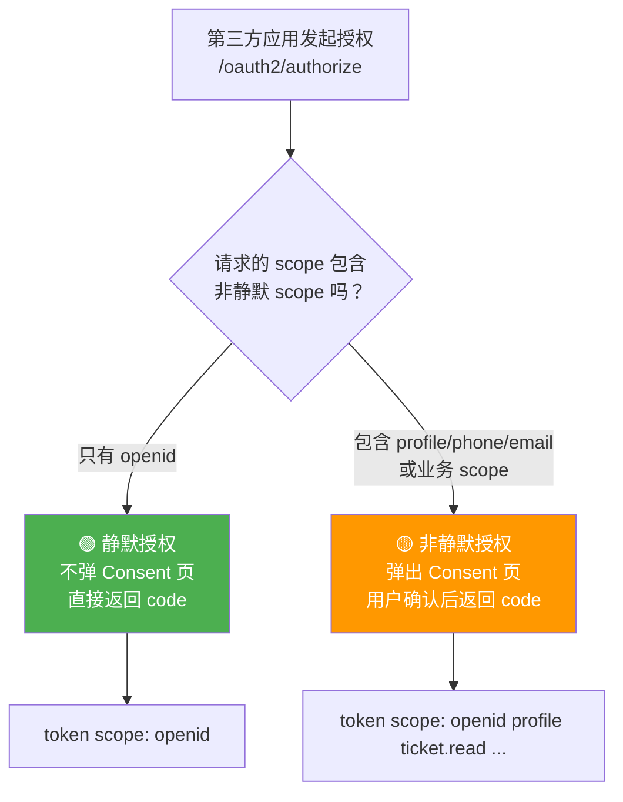
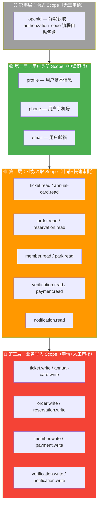
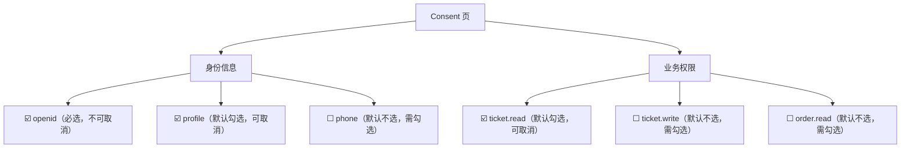
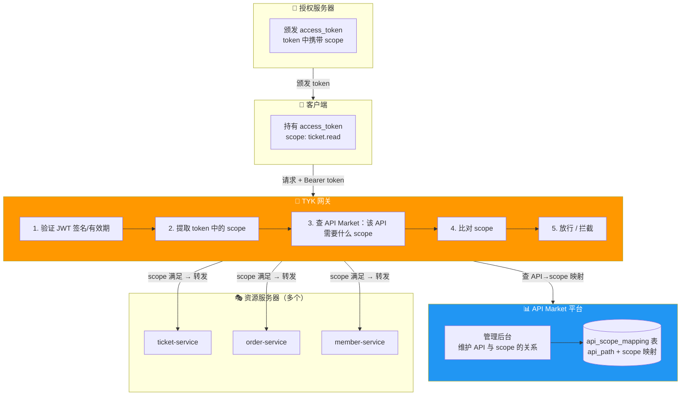
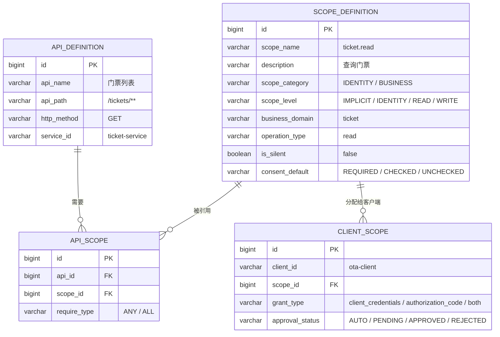
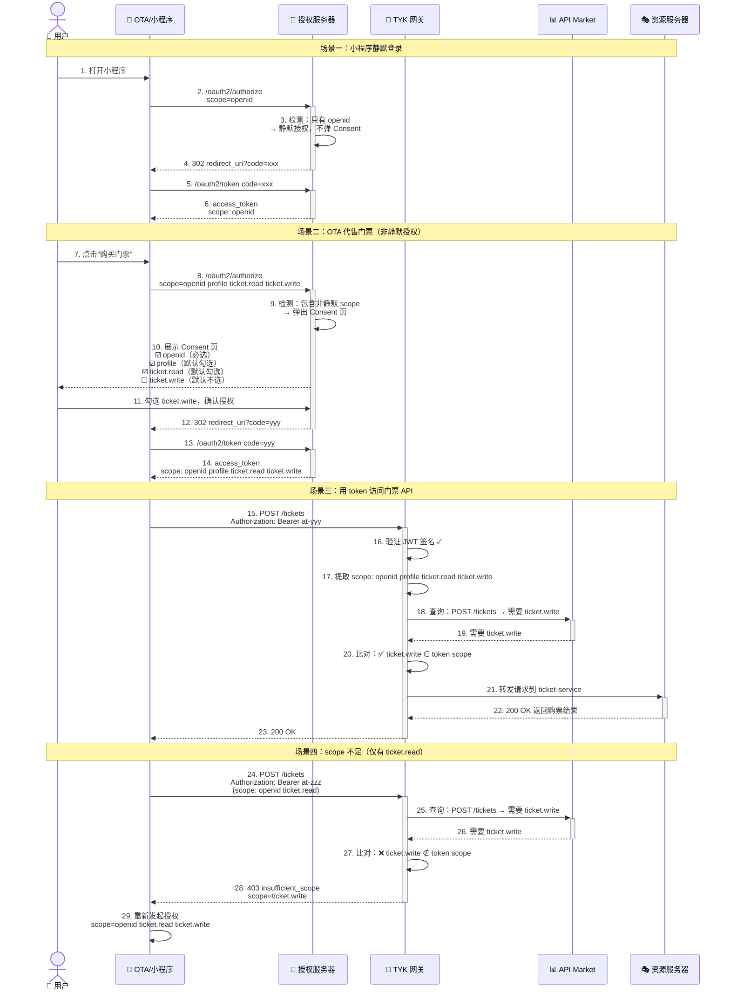
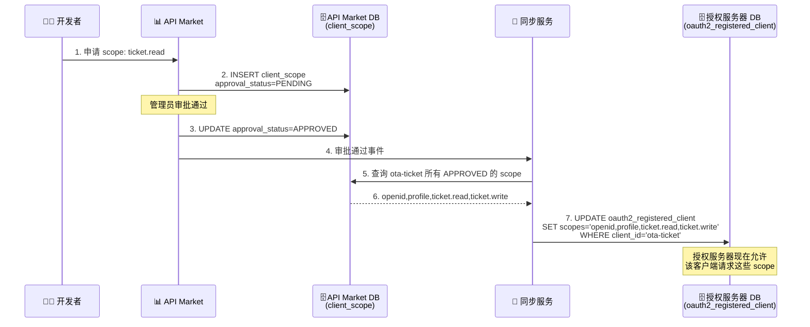
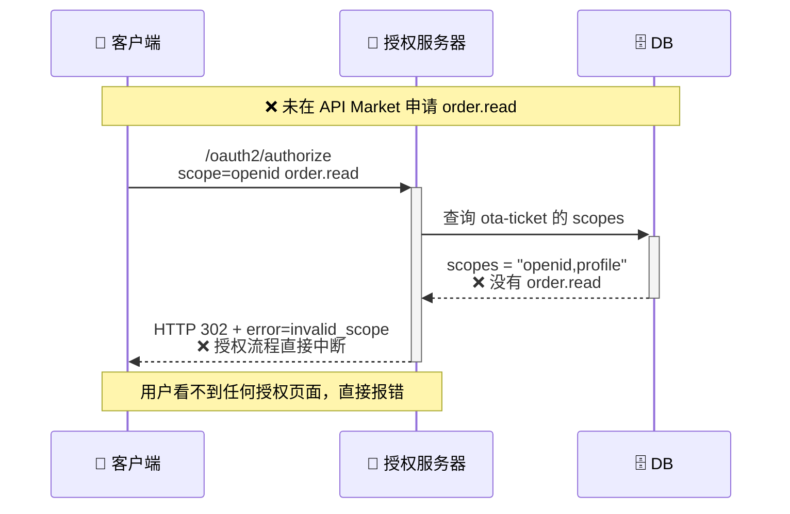
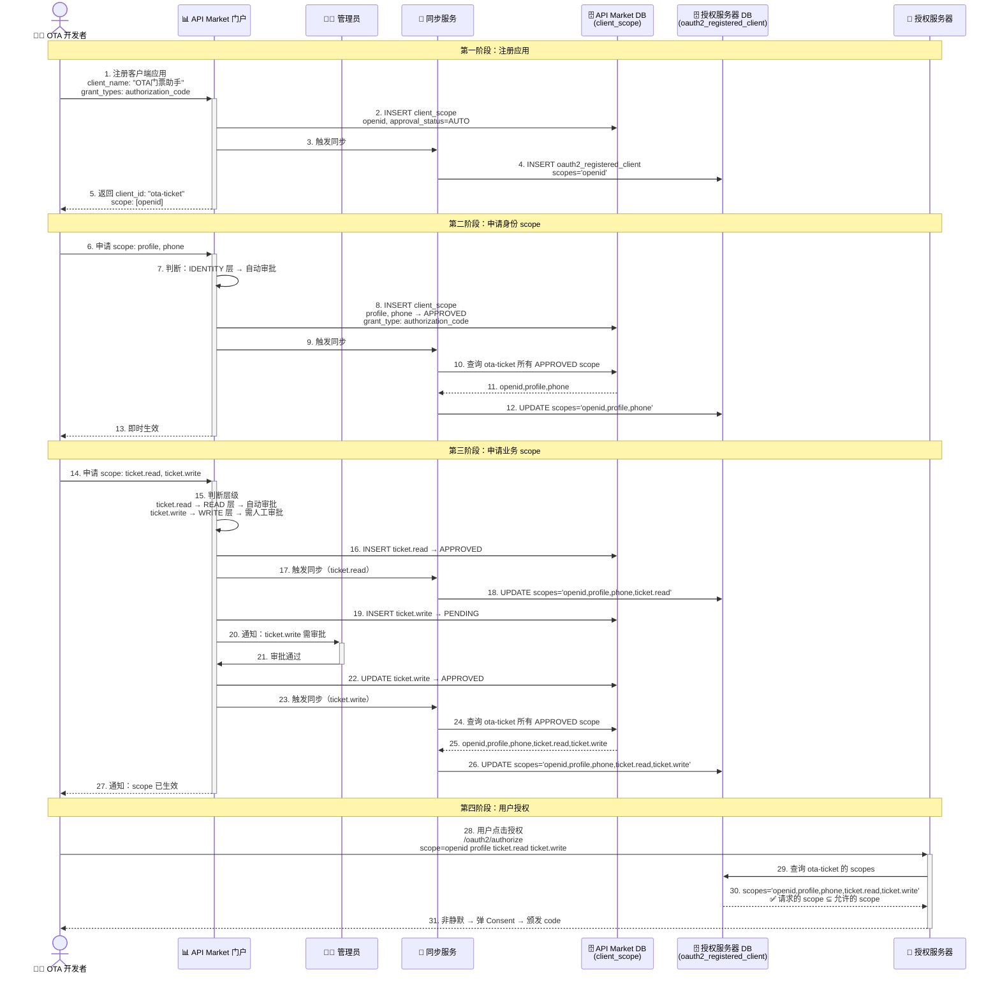

# Scope 体系设计方案

## 业务背景

我司是一家 TOC 业务的公司**主题乐园**，涉及的业务有年卡、门票、游园、会员、订单、预约、核销、个人中心等等。
其他第三方平台对接来对接，可能会获取用户信息，门票信息等。

## 技术背景

我司现有架构体系：TYK 网关平台，正在搭建的 API Market 平台，授权服务（基于 Spring Authorization Server）。

## 调研结论摘要

### 核心结论

1. **静默授权是 TOC 平台刚需**：微信和支付宝的模式证明了"先静默识别、再显式授权"是最优实践
2. **读写分离适合业务 API**：京东的 `业务域.操作类型` 模式命名可预测、权限控制精确
3. **Consent 三状态优化体验**：抖音的"必选/默认勾选/默认不选"让授权页更贴近业务场景

---

## Scope 命名规范

### 命名格式

**用户身份 Scope**（借鉴微信 `snsapi_` 前缀、支付宝 `auth_` 前缀）：

```
<身份域>
```

无点分、无操作后缀。身份 scope 是特殊的存在，不遵循业务域规则。

**业务 API Scope**（借鉴京东 `业务域.操作类型`）：

```
<业务域>.<操作类型>
```

- **业务域**：小写英文 + 连字符（多词用连字符），对应一组相关 API 资源
- **操作类型**：`read`（读取）或 `write`（写入/创建/删除/核销）
- **分隔符**：点号 `.`

### 命名规则

| 规则 | 说明 | 示例 |
|------|------|------|
| 身份 scope 特殊命名 | 不遵循业务域规则，单独定义 | `openid`、`profile`、`phone` |
| 业务域对应微服务 | 一个微服务对应一个业务域 | `ticket-service` → `ticket.*` |
| 多词业务域用连字符 | 保持可读性 | `annual-card.read` |
| 读写严格分离 | 读取用 `.read`，写入/创建/删除用 `.write` | `order.read` / `order.write` |
| 只读资源无 write | 如果业务域只有查询接口 | `park.read`（游园信息只读） |
| 禁止超细粒度 | 不拆到字段级别 | ✅ `ticket.read` ❌ `ticket.price.read` |
| 禁止超粗粒度 | 不使用 `all`、`*` 等通配 scope | ❌ `api.all` ❌ `*` |

### 命名对比

```
❌ 不好的命名                         ✅ 好的命名（本方案）
─────────────────────────────         ─────────────────────────────
snsapi_base            (微信风格)      openid
auth_user              (支付宝风格)     profile
user_info              (太粗)          profile + user.read
ticket                 (无操作)        ticket.read / ticket.write
annualcard_read        (无分隔)        annual-card.read
ticket.price.read      (太细)          ticket.read
api.all                (太危险)        按业务域逐个分配
```

---

## Scope 完整清单

### 1. 用户身份 Scope（authorization_code 专用）

| Scope | 说明 | 是否静默 | 映射 API | 对标平台 |
|-------|------|----------|----------|----------|
| `openid` | 获取用户唯一标识（sub/openid），不弹窗 | ✅ 静默 | `GET /userinfo`（仅返回 sub） | 微信 `snsapi_base` / 支付宝 `auth_base` |
| `profile` | 获取用户基本信息（昵称、头像等），弹窗确认 | ❌ 非静默 | `GET /userinfo`（返回 sub + 昵称 + 头像） | 微信 `snsapi_userinfo` / 支付宝 `auth_user` |
| `phone` | 获取用户手机号，弹窗确认 | ❌ 非静默 | `GET /user/phone` | 微信小程序 `scope.phone` |
| `email` | 获取用户邮箱，弹窗确认 | ❌ 非静默 | `GET /user/email` | 百度 `email` |

**静默授权规则**：



| 场景 | 请求 scope | 是否弹窗 | token 中获得 |
|------|-----------|----------|-------------|
| 静默识别用户 | `openid` | ❌ 不弹窗 | 仅 sub |
| 获取用户信息 | `openid profile` | ✅ 弹窗 | sub + 昵称 + 头像 |
| 获取手机号 | `openid phone` | ✅ 弹窗 | sub + 手机号 |
| 完整授权 | `openid profile phone ticket.read` | ✅ 弹窗 | 全部信息 + 业务权限 |

> **关键规则**：`openid` 是静默 scope，请求中**只有** `openid` 时不弹 Consent 页，直接返回授权码。只要包含任何非静默 scope，就必须弹 Consent 页。`openid` 在所有 authorization_code 流程中**自动包含**，无需显式请求。

### 2. 业务 API Scope（两种授权模式通用）

#### 2.1 门票业务域

| Scope | 说明 | 映射 API 示例 | 典型使用者 |
|-------|------|---------------|-----------|
| `ticket.read` | 查询门票信息、门票列表 | `GET /tickets/**` | OTA平台查门票 |
| `ticket.write` | 购买/退票/修改门票 | `POST /tickets`, `PUT /tickets/**`, `DELETE /tickets/**` | OTA平台代购票 |

#### 2.2 年卡业务域

| Scope | 说明 | 映射 API 示例 | 典型使用者 |
|-------|------|---------------|-----------|
| `annual-card.read` | 查询年卡信息、年卡权益 | `GET /annual-cards/**` | 会员平台查年卡 |
| `annual-card.write` | 购买/续费/激活年卡 | `POST /annual-cards`, `PUT /annual-cards/**` | 会员平台代办年卡 |

#### 2.3 订单业务域

| Scope | 说明 | 映射 API 示例 | 典型使用者 |
|-------|------|---------------|-----------|
| `order.read` | 查询订单信息、订单列表 | `GET /orders/**` | 订单追踪、财务对账 |
| `order.write` | 创建/取消/修改订单 | `POST /orders`, `PUT /orders/**` | 代下单、退款处理 |

#### 2.4 预约业务域

| Scope | 说明 | 映射 API 示例 | 典型使用者 |
|-------|------|---------------|-----------|
| `reservation.read` | 查询预约信息 | `GET /reservations/**` | 预约查询 |
| `reservation.write` | 创建/取消/修改预约 | `POST /reservations`, `PUT /reservations/**` | 代预约、预约管理 |

#### 2.5 核销业务域

| Scope | 说明 | 映射 API 示例 | 典型使用者 |
|-------|------|---------------|-----------|
| `verification.read` | 查询核销记录 | `GET /verifications/**` | 核销记录查询 |
| `verification.write` | 执行核销操作 | `POST /verifications/verify` | 闸机核销、人工核销 |

#### 2.6 会员业务域

| Scope | 说明 | 映射 API 示例 | 典型使用者 |
|-------|------|---------------|-----------|
| `member.read` | 查询会员信息、积分、等级 | `GET /members/**` | 会员画像、积分查询 |
| `member.write` | 修改会员信息、积分操作 | `PUT /members/**`, `POST /members/points/**` | 积分兑换、等级变更 |

#### 2.7 游园业务域（只读）

| Scope | 说明 | 映射 API 示例 | 典型使用者 |
|-------|------|---------------|-----------|
| `park.read` | 查询游园信息、设施状态、排队时间 | `GET /park/**` | 导览小程序、园区信息展示 |

> 游园信息属于公共信息，只提供 `.read`，无 `.write`。

#### 2.8 支付业务域

| Scope | 说明 | 映射 API 示例 | 典型使用者 |
|-------|------|---------------|-----------|
| `payment.read` | 查询支付记录 | `GET /payments/**` | 财务对账 |
| `payment.write` | 发起支付、退款 | `POST /payments/charge`, `POST /payments/refund` | 支付网关 |

#### 2.9 通知业务域

| Scope | 说明 | 映射 API 示例 | 典型使用者 |
|-------|------|---------------|-----------|
| `notification.read` | 读取通知消息 | `GET /notifications/**` | 通知聚合 |
| `notification.write` | 发送通知、标记已读 | `POST /notifications/**` | 消息推送 |

### 3. Scope 全景一览

```
┌──────────────────────────────────────────────────────────────┐
│                    用户身份 Scope (IDENTITY)                   │
│  ┌────────┐  ┌─────────┐  ┌───────┐  ┌───────┐              │
│  │ openid │  │ profile │  │ phone │  │ email │              │
│  │ (静默) │  │(非静默) │  │(非静默)│  │(非静默)│              │
│  └────────┘  └─────────┘  └───────┘  └───────┘              │
└──────────────────────────────────────────────────────────────┘

┌──────────────────────────────────────────────────────────────┐
│                    业务 API Scope (BUSINESS)                   │
│                                                               │
│  门票域         年卡域           订单域          预约域         │
│  ticket.read    annual-card.read   order.read    reservation.read
│  ticket.write   annual-card.write  order.write   reservation.write
│                                                               │
│  核销域           会员域         游园域          支付域         │
│  verification.read  member.read    park.read     payment.read
│  verification.write member.write                 payment.write
│                                                               │
│  通知域                                                       │
│  notification.read                                            │
│  notification.write                                           │
└──────────────────────────────────────────────────────────────┘
```

---

## Scope 分层模型（四层）



| 层级 | 审批要求 | 是否静默 | 主题乐园典型场景 |
|------|----------|----------|----------------|
| ⚪ 隐式 Scope | 无需申请，自动包含 | ✅ 静默 | 闸机扫码识别用户、小程序自动登录 |
| 🟢 身份 Scope | 提交申请，自动审批 | ❌ 非静默 | 获取昵称头像展示欢迎页、获取手机号绑定会员 |
| 🟡 读取 Scope | 提交申请，自动或快速审批 | ❌ 非静默 | OTA查门票价格、合作伙伴查订单状态 |
| 🔴 写入 Scope | 提交申请，必须人工审核 | ❌ 非静默 | OTA代售票、闸机核销、发起退款 |

---

## 两种授权模式下的 Scope 使用


| 维度 | authorization_code | client_credentials |
|------|-------------------|-------------------|
| **适用场景** | 第三方应用代表用户操作（OTA代售票、小程序登录） | 服务器间 API 调用（内部服务互通） |
| **可用的身份 scope** | ✅ `openid`、`profile`、`phone`、`email` | ❌ 不适用（无用户） |
| **可用的业务 scope** | ✅ 用户 consent 确认的业务 scope | ✅ 管理员分配的业务 scope |
| **是否弹 Consent 页** | 取决于 scope 是否包含非静默 scope | 不需要 |
| **token 中的 sub** | 用户 ID | 客户端 ID |

### 主题乐园典型场景

| 场景 | 授权模式 | Scope | 说明 |
|------|----------|-------|------|
| 小程序静默登录 | authorization_code | `openid` | 用户进入小程序自动识别身份 |
| OTA 代售门票 | authorization_code | `openid profile ticket.read ticket.write` | 用户授权 OTA 查询和购买门票 |
| 合作伙伴查询订单 | client_credentials | `order.read` | 服务器间查询订单状态 |
| 闸机核销系统 | client_credentials | `verification.read verification.write` | 闸机服务核销门票 |
| 会员积分兑换 | authorization_code | `openid member.read member.write` | 用户授权积分操作 |

---

## Consent 页设计（借鉴抖音三状态）

当授权请求包含非静默 scope 时，弹出 Consent 页。参考抖音的三种权限勾选状态：



| 勾选状态 | 适用 scope | 用户体验 | 主题乐园场景 |
|----------|-----------|----------|-------------|
| **必选，不可取消** | `openid` | 灰色勾选，不可操作 | 身份识别是最基础需求 |
| **默认勾选，可取消** | `profile`、`*.read` | 勾选状态，可取消 | 查门票价格、查游园信息等低风险操作 |
| **默认不选，需勾选** | `phone`、`email`、`*.write` | 未勾选状态，需主动勾选 | 手机号、购票/核销/退款等敏感操作 |

---

## 网关 + API Market 架构下的 Scope 校验

> 详细架构图解见 [api-market-gateway-scope-diagrams](api-market-gateway-scope-diagrams.md)

### 核心架构



### 各组件职责

| 组件 | 验证 JWT 签名 | 验证 scope | 维护 scope 规则 | 说明 |
|------|:---:|:---:|:---:|------|
| 授权服务器 | ✅ 颁发时 | ✅ **第一道关卡** | ❌ | 管"token 里能写什么 scope"——验证请求的 scope ⊆ registered_client.scopes |
| TYK 网关 | ✅ | ✅ **第二道关卡** | ❌ | 管"token 里的 scope 能访问什么 API"——验证 token scope ⊇ API 所需 scope |
| 资源服务器 | ✅ | ❌ | ❌ | 只验签名，scope 校验已由网关完成 |
| API Market | ❌ | ❌ | ✅ **核心** | 数据源：定义"哪个 API 需要什么 scope" |

### 为什么需要两道 Scope 关卡

系统中存在**两道独立的 scope 校验**，它们在不同时机、针对不同问题，缺一不可：

| | 第一道：授权服务器（`registered_client.scopes`） | 第二道：TYK 网关（API Market 映射） |
|---|---|---|
| **校验时机** | 颁发 token **之前** | 使用 token 访问 API **时** |
| **校验什么** | 客户端**能不能请求**这个 scope | token 里**有没有**这个 scope |
| **校验逻辑** | `请求的 scope` ⊆ `registered_client.scopes` | `token 的 scope` ⊇ `API 所需 scope` |
| **失败结果** | 授权流程直接中断，token 都拿不到 | 返回 403 insufficient_scope |
| **管的问题** | token 里**能写什么** scope | token 里写的 scope **能访问什么** API |

**去掉第一道（不同步到授权服务器）的后果**：

如果 `order.read` 没有同步到 `oauth2_registered_client.scopes`，客户端请求 `/oauth2/authorize?scope=order.read` 时，SAS 会直接报 `invalid_scope`，授权流程中断——客户端**根本拿不到带 order.read 的 token**，网关的 scope 校验永远没有机会执行。

**去掉第二道（网关不校验 scope）的后果**：

即使 token 中只有 `order.read`，客户端也可以访问需要 `order.write` 的 API——因为没有任何组件在 API 访问时比对 token scope 与 API 要求。

**典型场景——用户只同意了部分 scope**：

```
客户端请求 scope=openid order.read order.write
  → 第一道（AS）：order.read ✅ order.write ✅（都在 registered_client.scopes 中）
  → Consent 页：用户只勾选了 order.read，没勾 order.write
  → 颁发 token scope: openid order.read（不含 order.write）
  → 访问 POST /orders（需要 order.write）
  → 第二道（网关）：token 没有 order.write → ❌ 403 insufficient_scope
```

这个场景中，两道关卡各拦截了不同的问题：AS 确保只有经过审批的 scope 才能写进 token，网关确保 token 的 scope 与 API 要求匹配。

> **同步的本质**：把 API Market 的审批结果（"允许这个客户端请求什么 scope"）转化为 SAS 能识别的格式（`registered_client.scopes`），让 SAS 在颁发 token 时就能做第一道拦截，而不是等到网关才发现问题。

---

## Scope 与 API 的映射规则

### 数据模型



### 映射示例

**scope_definition**

| id | scope_name | description | scope_category | scope_level | business_domain | is_silent | consent_default |
|----|-----------|-------------|---------------|-------------|-----------------|-----------|----------------|
| 0 | openid | 用户唯一标识 | IDENTITY | IMPLICIT | - | true | REQUIRED |
| 1 | profile | 用户基本信息 | IDENTITY | IDENTITY | - | false | CHECKED |
| 2 | phone | 用户手机号 | IDENTITY | IDENTITY | - | false | UNCHECKED |
| 3 | email | 用户邮箱 | IDENTITY | IDENTITY | - | false | UNCHECKED |
| 4 | ticket.read | 查询门票 | BUSINESS | READ | ticket | false | CHECKED |
| 5 | ticket.write | 购买/退票 | BUSINESS | WRITE | ticket | false | UNCHECKED |
| 6 | annual-card.read | 查询年卡 | BUSINESS | READ | annual-card | false | CHECKED |
| 7 | annual-card.write | 购买/续费年卡 | BUSINESS | WRITE | annual-card | false | UNCHECKED |
| 8 | order.read | 查询订单 | BUSINESS | READ | order | false | CHECKED |
| 9 | order.write | 创建/取消订单 | BUSINESS | WRITE | order | false | UNCHECKED |
| 10 | reservation.read | 查询预约 | BUSINESS | READ | reservation | false | CHECKED |
| 11 | reservation.write | 创建/取消预约 | BUSINESS | WRITE | reservation | false | UNCHECKED |
| 12 | verification.read | 查询核销记录 | BUSINESS | READ | verification | false | CHECKED |
| 13 | verification.write | 执行核销 | BUSINESS | WRITE | verification | false | UNCHECKED |
| 14 | member.read | 查询会员信息 | BUSINESS | READ | member | false | CHECKED |
| 15 | member.write | 修改会员/积分 | BUSINESS | WRITE | member | false | UNCHECKED |
| 16 | park.read | 游园信息 | BUSINESS | READ | park | false | CHECKED |
| 17 | payment.read | 查询支付记录 | BUSINESS | READ | payment | false | CHECKED |
| 18 | payment.write | 发起支付/退款 | BUSINESS | WRITE | payment | false | UNCHECKED |
| 19 | notification.read | 读取通知 | BUSINESS | READ | notification | false | CHECKED |
| 20 | notification.write | 发送通知 | BUSINESS | WRITE | notification | false | UNCHECKED |

**api_definition**

| id | api_name | api_path | http_method | service_id |
|----|----------|----------|-------------|------------|
| 1 | 用户身份 | /userinfo | GET | user-service |
| 2 | 用户手机号 | /user/phone | GET | user-service |
| 3 | 门票列表 | /tickets/** | GET | ticket-service |
| 4 | 购买门票 | /tickets | POST | ticket-service |
| 5 | 退票 | /tickets/*/refund | POST | ticket-service |
| 6 | 年卡信息 | /annual-cards/** | GET | annual-card-service |
| 7 | 购买年卡 | /annual-cards | POST | annual-card-service |
| 8 | 订单查询 | /orders/** | GET | order-service |
| 9 | 创建订单 | /orders | POST | order-service |
| 10 | 预约查询 | /reservations/** | GET | reservation-service |
| 11 | 创建预约 | /reservations | POST | reservation-service |
| 12 | 核销 | /verifications/verify | POST | verification-service |
| 13 | 核销记录 | /verifications/** | GET | verification-service |
| 14 | 会员信息 | /members/** | GET | member-service |
| 15 | 积分操作 | /members/points/** | POST | member-service |
| 16 | 游园信息 | /park/** | GET | park-service |
| 17 | 发起支付 | /payments/charge | POST | payment-service |
| 18 | 退款 | /payments/refund | POST | payment-service |

**api_scope**

| id | api_id | scope_id | require_type | 说明 |
|----|--------|----------|-------------|------|
| 1 | 1 | 0 | ALL | /userinfo 至少需要 openid |
| 2 | 1 | 1 | ANY | 有 profile 则返回更多信息 |
| 3 | 2 | 2 | ALL | 手机号必须 phone scope |
| 4 | 3 | 4 | ALL | 门票列表需要 ticket.read |
| 5 | 4 | 5 | ALL | 购买门票需要 ticket.write |
| 6 | 5 | 5 | ALL | 退票需要 ticket.write |
| 7 | 6 | 6 | ALL | |
| 8 | 7 | 7 | ALL | |
| 9 | 8 | 8 | ALL | |
| 10 | 9 | 9 | ALL | |
| 11 | 10 | 10 | ALL | |
| 12 | 11 | 11 | ALL | |
| 13 | 12 | 13 | ALL | 核销需要 verification.write |
| 14 | 13 | 12 | ALL | |
| 15 | 14 | 14 | ALL | |
| 16 | 15 | 15 | ALL | |
| 17 | 16 | 16 | ALL | |
| 18 | 17 | 18 | ALL | |
| 19 | 18 | 18 | ALL | |

---

## Scope 校验规则

### 网关校验逻辑（伪代码）

```java
// 网关 ScopeAuthorizationFilter 核心逻辑
public boolean checkScope(HttpServletRequest request, Jwt jwt) {
    // 1. 提取请求信息
    String path = request.getRequestURI();      // /tickets
    String method = request.getMethod();         // POST

    // 2. 查 API Market：该 API 需要什么 scope
    List<ScopeRequirement> requirements = apiMarketService.getRequiredScopes(path, method);
    // → [{scope: "ticket.write", requireType: "ALL"}]

    // 3. 如果没有 scope 要求，直接放行
    if (requirements.isEmpty()) {
        return true;
    }

    // 4. 提取 token 中的 scope
    Set<String> tokenScopes = jwt.getClaimAsStringList("scope");
    // → ["openid", "profile", "ticket.read"]

    // 5. 按组校验
    // ALL 组：token 必须包含全部
    // ANY 组：token 包含任一即可
    return matchScopes(tokenScopes, requirements);
}
```

### 授权服务器静默判断逻辑

```java
// 授权服务器判断是否需要弹出 Consent 页
public boolean requiresConsent(Set<String> requestedScopes) {
    // openid 是隐式 scope，自动包含
    // 只有 openid → 静默，不需要 Consent
    Set<String> nonImplicitScopes = requestedScopes.stream()
        .filter(s -> !s.equals("openid"))
        .collect(Collectors.toSet());

    return !nonImplicitScopes.isEmpty();
}
```

### 校验规则明细

| 规则 | 说明 | 示例 |
|------|------|------|
| **静默判断** | 只有 `openid` 时不弹 Consent，直接返回 code | scope=`openid` → 静默 |
| **非静默判断** | 包含任何非 `openid` 的 scope 时弹 Consent | scope=`openid profile` → 弹窗 |
| **openid 自动包含** | authorization_code 流程中 `openid` 始终在 token 中 | 即使不显式请求也会包含 |
| **read 不包含 write** | `ticket.read` 只能访问 GET 接口 | `ticket.read` 不能 POST /tickets |
| **write 不包含 read** | `ticket.write` 只能访问写接口 | `ticket.write` 不能 GET /tickets |
| **身份 scope 仅限 authorization_code** | client_credentials 模式不能申请 `profile`、`phone` | 服务器间调用无用户概念 |
| **openid 无业务权限** | `openid` 只能访问 /userinfo（仅 sub） | `openid` 不能访问 /tickets |
| **未配置 scope 的 API 直接放行** | API Market 没有该 API 的 scope 配置 | 公开接口无需 scope |

---

## 完整授权流程时序图



---

## 客户端 Scope 申请与审批流程

### 两层存储模型

客户端的 scope 信息涉及**两层存储**，必须协同工作：

| 存储位置 | 表 | 存什么 | 谁写入 | 何时写入 |
|----------|-----|--------|--------|----------|
| API Market 数据库 | `client_scope` | 客户端申请的 scope + 审批状态 | API Market 门户 | 开发者申请时 |
| 授权服务器数据库 | `oauth2_registered_client.scopes` | 客户端被允许的 scope 列表（逗号分隔字符串） | 同步服务 | scope 审批通过/收回时 |

#### 第一层：API Market — `client_scope` 表（管理侧）

管理"客户端能申请哪些 scope"及审批状态：

```sql
-- API Market 数据库
CREATE TABLE client_scope (
    id              BIGINT PRIMARY KEY,
    client_id       VARCHAR(100) NOT NULL,      -- 客户端标识
    scope_id        BIGINT NOT NULL,            -- → scope_definition.id
    grant_type      VARCHAR(50),                -- client_credentials / authorization_code / both
    approval_status VARCHAR(20),                -- AUTO / PENDING / APPROVED / REJECTED
    created_at      TIMESTAMP,
    approved_at     TIMESTAMP
);
```

示例数据：

| id | client_id | scope_id | grant_type | approval_status |
|----|-----------|----------|------------|----------------|
| 1 | ota-ticket | 0 (openid) | authorization_code | AUTO |
| 2 | ota-ticket | 1 (profile) | authorization_code | AUTO |
| 3 | ota-ticket | 4 (ticket.read) | both | APPROVED |
| 4 | ota-ticket | 5 (ticket.write) | authorization_code | PENDING → APPROVED |

**作用**：API Market 门户管理审批流程，记录"谁申请了什么 scope、审批到哪一步"。

#### 第二层：授权服务器 — `oauth2_registered_client.scopes`（运行时）

Spring Authorization Server 原生使用 `oauth2_registered_client` 表的 `scopes` 列存储客户端**最终被允许的 scope 列表**：

```sql
-- 授权服务器数据库（SAS 原生表）
CREATE TABLE oauth2_registered_client (
    id                            VARCHAR(100) NOT NULL,
    client_id                     VARCHAR(100) NOT NULL,
    scopes                        VARCHAR(1000) NOT NULL,  -- ← 逗号分隔的 scope 字符串
    -- ... 其他字段
    PRIMARY KEY (id)
);
```

示例数据：

| client_id | scopes |
|-----------|--------|
| ota-ticket | `openid,profile,ticket.read,ticket.write` |

**关键机制**：SAS 在颁发 token 时，会验证 `请求的 scope ⊆ registered_client.scopes`，超出范围直接报 `INVALID_SCOPE` 错误：

```java
// OAuth2AuthorizationCodeRequestAuthenticationValidator.java
Set<String> requestedScopes = authentication.getScopes();      // 客户端请求的 scope
Set<String> allowedScopes = registeredClient.getScopes();      // 从 DB 读取该客户端被允许的 scope

if (!allowedScopes.containsAll(requestedScopes)) {
    throw new OAuth2AuthenticationException(OAuth2ErrorCodes.INVALID_SCOPE);
    // → 直接报错，不会进入后续授权流程
}
```

> **核心规则**：客户端必须先在 API Market 申请 scope 并审批通过，scope 才会同步到 `oauth2_registered_client.scopes`，之后发起授权请求时 SAS 才允许。未申请的 scope 直接请求会被 SAS 拒绝，用户根本看不到授权页面。

### 两层存储同步机制



**同步规则**：

| 时机 | 操作 |
|------|------|
| scope 审批通过 | 将该 client 所有 APPROVED 的 scope 拼接为逗号分隔字符串，更新到 `oauth2_registered_client.scopes` |
| scope 审批拒绝 | 不更新，该 scope 不会出现在 scopes 列表中 |
| scope 被收回 | 重新拼接 APPROVED 的 scope，更新到 `oauth2_registered_client.scopes` |
| 新增 scope | 追加到已有 scopes 字符串中，更新到 `oauth2_registered_client.scopes` |

### 未申请 scope 直接授权会被拒绝



### 完整申请与审批时序图



### Scope 存储全景

```
申请审批阶段:
  API Market client_scope 表 → (同步服务) → oauth2_registered_client.scopes

授权阶段:
  用户请求 scope → SAS 验证 ⊆ registered_client.scopes → 写入 oauth2_authorization.authorized_scopes

Token 颁发阶段:
  authorized_scopes → JWT scope claim（空格分隔）→ 网关提取校验

用户同意阶段:
  Consent 页确认 → oauth2_authorization_consent 表记录用户授权
```

| 阶段 | 存储位置 | 存什么 | 格式 |
|------|----------|--------|------|
| 申请审批 | `client_scope`（API Market） | 客户端申请的 scope + 审批状态 | 每行一个 scope |
| 同步生效 | `oauth2_registered_client.scopes`（授权服务器） | 客户端被允许的 scope 列表 | 逗号分隔字符串 |
| 授权记录 | `oauth2_authorization.authorized_scopes`（授权服务器） | 本次授权实际批准的 scope | 逗号分隔字符串 |
| 用户同意 | `oauth2_authorization_consent`（授权服务器） | 用户对某客户端的授权同意记录 | authorities 字段 |
| Token 携带 | JWT `scope` claim | token 中携带的 scope | 空格分隔字符串（OAuth 2.0 规范） |

---

## 典型第三方对接场景

### 场景1：OTA 平台代售门票

| 维度 | 说明 |
|------|------|
| **授权模式** | authorization_code |
| **申请的 scope** | `openid profile ticket.read ticket.write order.read` |
| **Consent 页** | ☑️ openid（必选）☑️ profile（默认勾选）☑️ ticket.read（默认勾选）☐ ticket.write（默认不选）☑️ order.read（默认勾选） |
| **审批层级** | ticket.write 需人工审核 |
| **用户感知** | 用户在 OTA 平台购票时，跳转授权页确认"允许OTA代购门票" |

### 场景2：闸机核销系统

| 维度 | 说明 |
|------|------|
| **授权模式** | client_credentials（服务器间调用） |
| **申请的 scope** | `verification.read verification.write ticket.read` |
| **Consent 页** | 无（client_credentials 不涉及用户授权） |
| **审批层级** | verification.write 需人工审核 |
| **说明** | 闸机服务不需要用户授权，由管理员分配 scope |

### 场景3：小程序静默登录 + 会员信息

| 维度 | 说明 |
|------|------|
| **授权模式** | authorization_code |
| **首次进入** | scope=`openid` → 静默，不弹窗，识别用户 |
| **点击"会员中心"** | scope=`openid profile member.read` → 弹 Consent，获取会员信息 |
| **审批层级** | member.read 自动审批 |

### 场景4：合作伙伴查询游园信息

| 维度 | 说明 |
|------|------|
| **授权模式** | client_credentials |
| **申请的 scope** | `park.read` |
| **说明** | 游园信息是公共数据，park.read 自动审批，适合导览类应用 |

---

## Scope 扩展性设计

### 新增业务域

```
新增业务域只需 3 步：

1. API Market 管理后台新增 scope_definition：
   INSERT INTO scope_definition (scope_name, description, scope_category, scope_level, business_domain, operation_type, is_silent, consent_default)
   VALUES ('parking.read', '查询停车场', 'BUSINESS', 'READ', 'parking', 'read', false, 'CHECKED'),
          ('parking.write', '预约车位', 'BUSINESS', 'WRITE', 'parking', 'write', false, 'UNCHECKED');

2. 为新 API 配置 scope 映射：
   INSERT INTO api_scope (api_id, scope_id) VALUES (新API_id, parking.read_id);

3. 网关自动感知变更（通过消息总线刷新缓存）
   → 资源服务器零改动
```

### Scope 版本化

```
当 API 发生不兼容变更时，支持 scope 版本化：

v1 阶段：ticket.read, ticket.write
v2 阶段：ticket.read, ticket.write, ticket.v2.read, ticket.v2.write

- 旧客户端继续使用 v1 scope
- 新客户端申请 v2 scope
- 渐进式迁移，无强制切换
```

---

## 安全最佳实践

| 实践 | 说明 |
|------|------|
| **最小权限原则** | 客户端默认只有 `openid`，按需申请身份和业务 scope |
| **静默 scope 仅限 openid** | 只有 `openid` 可以静默授权，其他所有 scope 必须用户确认 |
| **write scope 需人工审核** | 所有 `.write` scope 必须人工审核，防止误操作（如误退票、误退款） |
| **身份 scope 仅限 authorization_code** | `profile`、`phone`、`email` 不能分配给 client_credentials 模式 |
| **敏感信息默认不选** | `phone`、`email` 在 Consent 页默认不勾选，用户需主动勾选 |
| **核销操作特殊管控** | `verification.write` 需最高级别审批，核销直接关系到票务安全 |
| **定期审计** | 管理后台展示"scope 使用统计"，识别异常调用 |
| **scope 不可超出** | token 中的 scope 只能是 client_scope 的子集 |
| **拒绝通配 scope** | 不允许 `*`、`all` 等通配 scope |
| **敏感操作二次确认** | `payment.write`、`ticket.write` 等高危 scope 在 Consent 页强制展示 |

---

## 与各平台方案的对比总结

| 设计维度 | 本方案 | 微信 | 支付宝 | 京东 | 抖音 |
|----------|--------|------|--------|------|------|
| 静默授权 | ✅ `openid` | ✅ `snsapi_base` | ✅ `auth_base` | ❌ | ❌ |
| 非静默用户信息 | `profile` | `snsapi_userinfo` | `auth_user` | ❌ | `user_info` |
| 命名格式 | 身份: 单词<br/>业务: `域.操作` | `前缀_功能` | `前缀_功能` | `域.操作` | 混合 |
| 读写分离 | ✅ 业务 scope | ❌ | ❌ | ✅ | ❌ |
| 分层审批 | ✅ 四层 | ❌ | ❌ | ❌ | ✅ 三状态 |
| Consent 勾选状态 | ✅ 三状态 | ❌ | ❌ | ❌ | ✅ |
| scope 与 API 映射 | ✅ 数据库配置 | N/A | N/A | 硬编码 | 能力管理 |
| 主题乐园适配 | ✅ 门票/年卡/核销等 | ❌ | ❌ | ❌ | ❌ |

---

## 实施路径

### 第一阶段：基础框架搭建

1. **授权服务器**：实现 `openid` 静默授权 + `profile` 非静默授权
2. **API Market**：建立 `scope_definition` 和 `api_scope` 表
3. **TYK 网关**：实现 JWT 签名验证 + scope 提取 + API Market 映射查询
4. **验证**：完成静默登录 + 获取用户信息两个基本场景

### 第二阶段：业务 Scope 接入

1. **首批业务域**：`ticket.*`、`order.*`、`member.*`
2. **Consent 页**：实现三状态勾选
3. **审批流程**：READ 自动审批 + WRITE 人工审批
4. **验证**：完成 OTA 代售门票场景

### 第三阶段：全量覆盖

1. **剩余业务域**：`annual-card.*`、`reservation.*`、`verification.*`、`park.read`、`payment.*`、`notification.*`
2. **网关缓存刷新**：消息总线通知机制
3. **管理后台**：scope 使用统计、审计日志
4. **验证**：闸机核销、年卡续费等场景

---

**一句话总结**：主题乐园 scope 设计 = 微信/支付宝的「`openid` 静默 / `profile` 非静默」用户身份层 + 京东的「`业务域.read`/`业务域.write`」业务 API 层 + 抖音的「必选/默认勾选/默认不选」Consent 体验，四层审批（隐式→身份→读取→写入），身份 scope 仅限 authorization_code，业务 scope 两种模式通用，覆盖门票/年卡/订单/预约/核销/会员/游园/支付/通知九大业务域。
