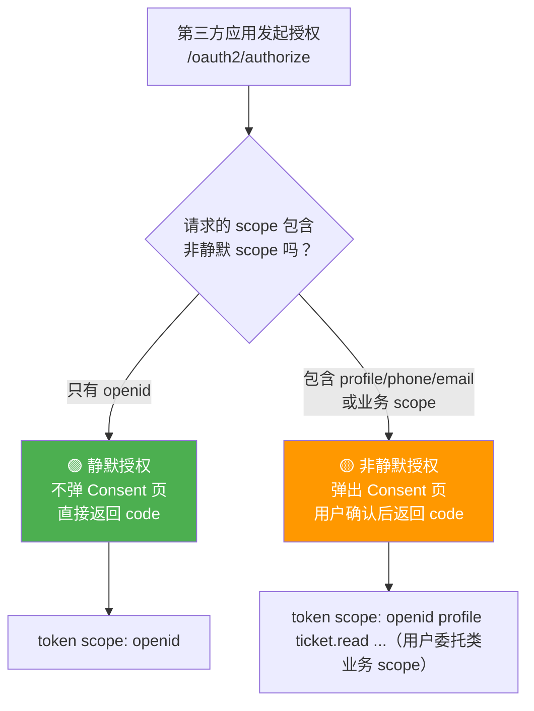
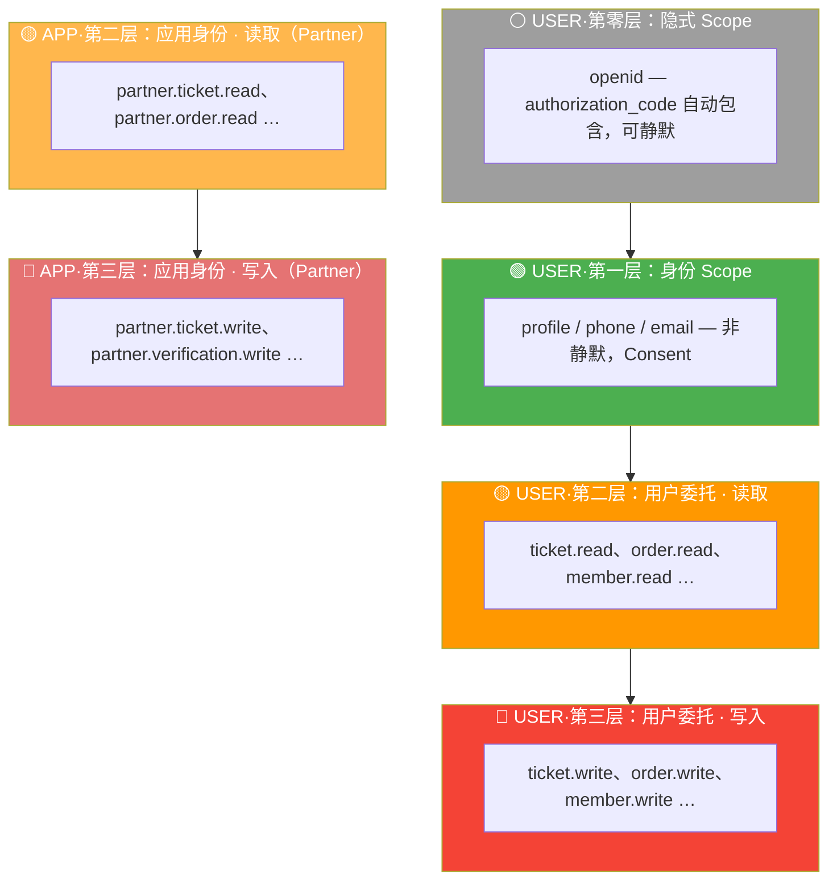
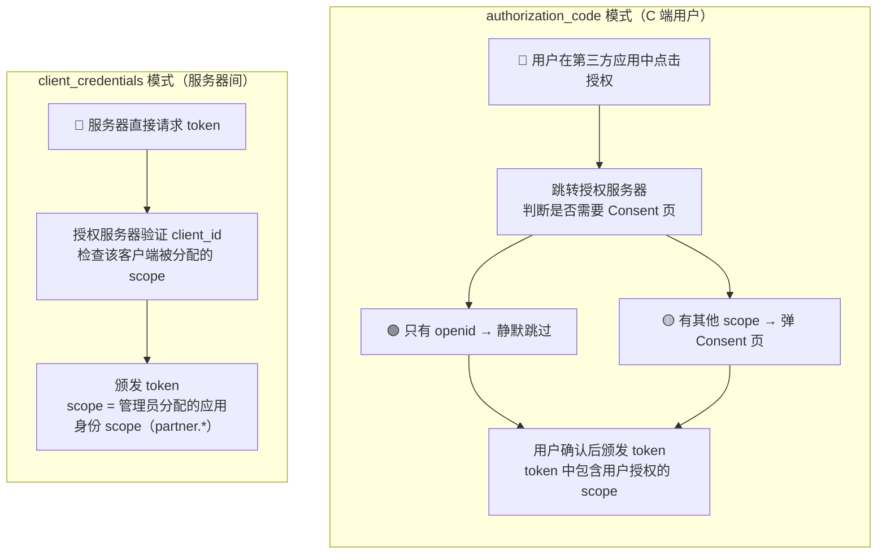
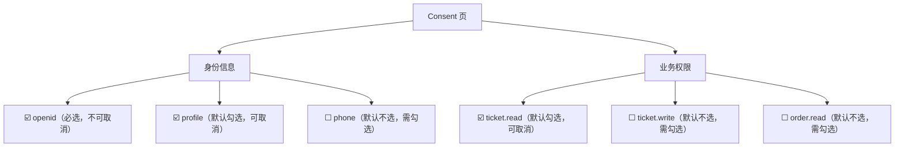
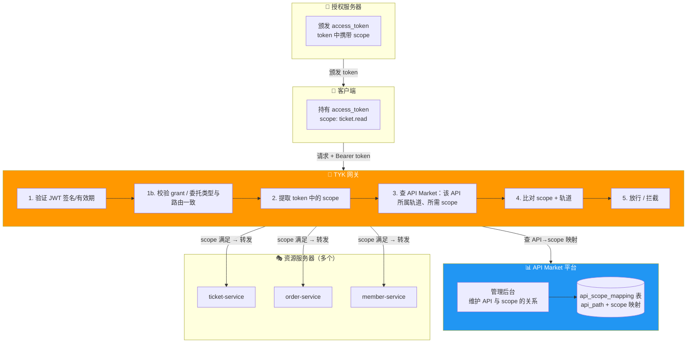
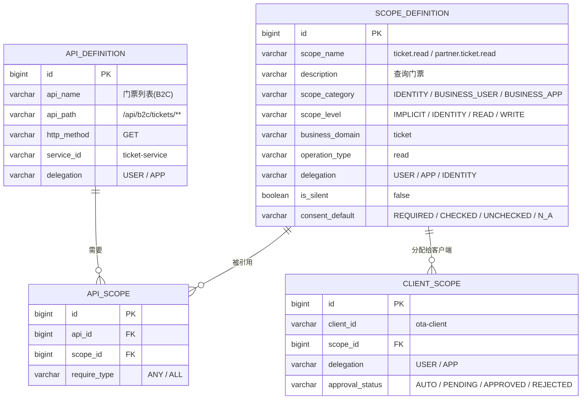
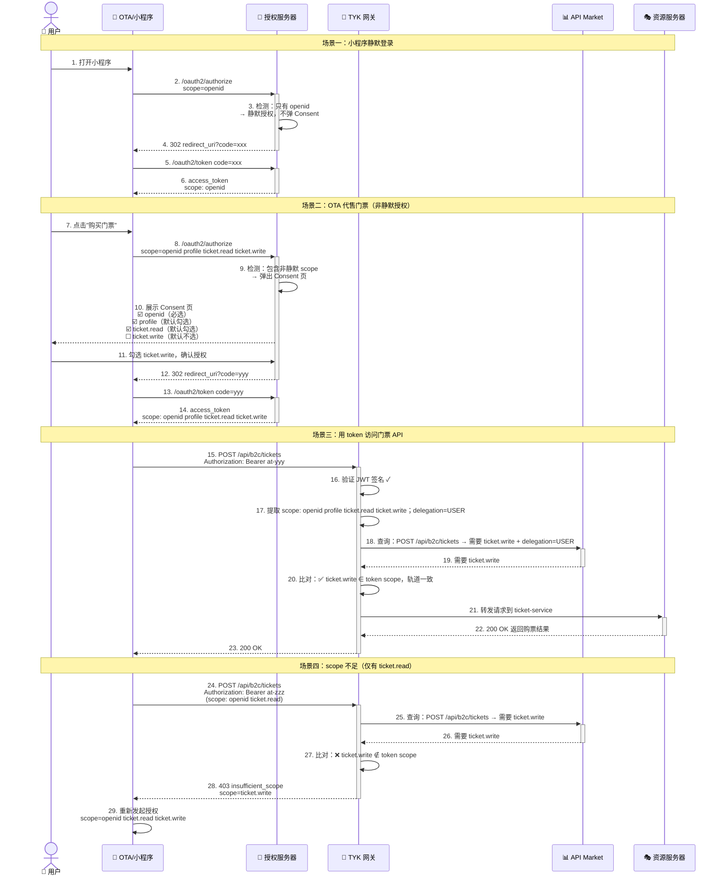
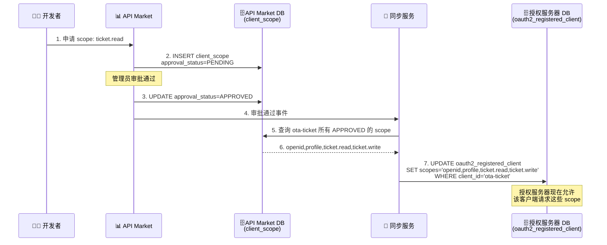
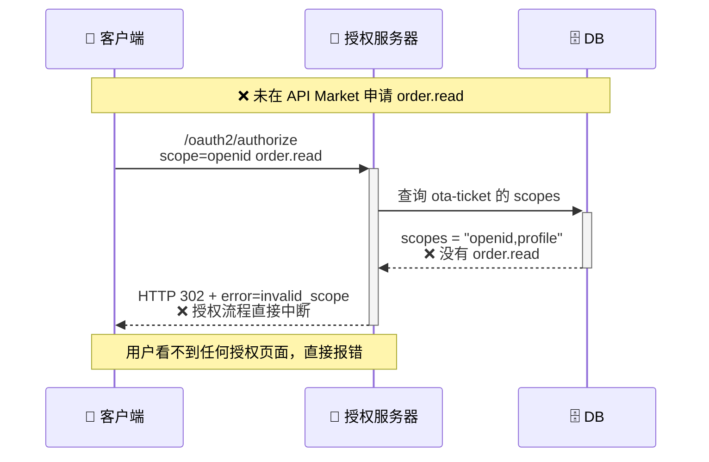
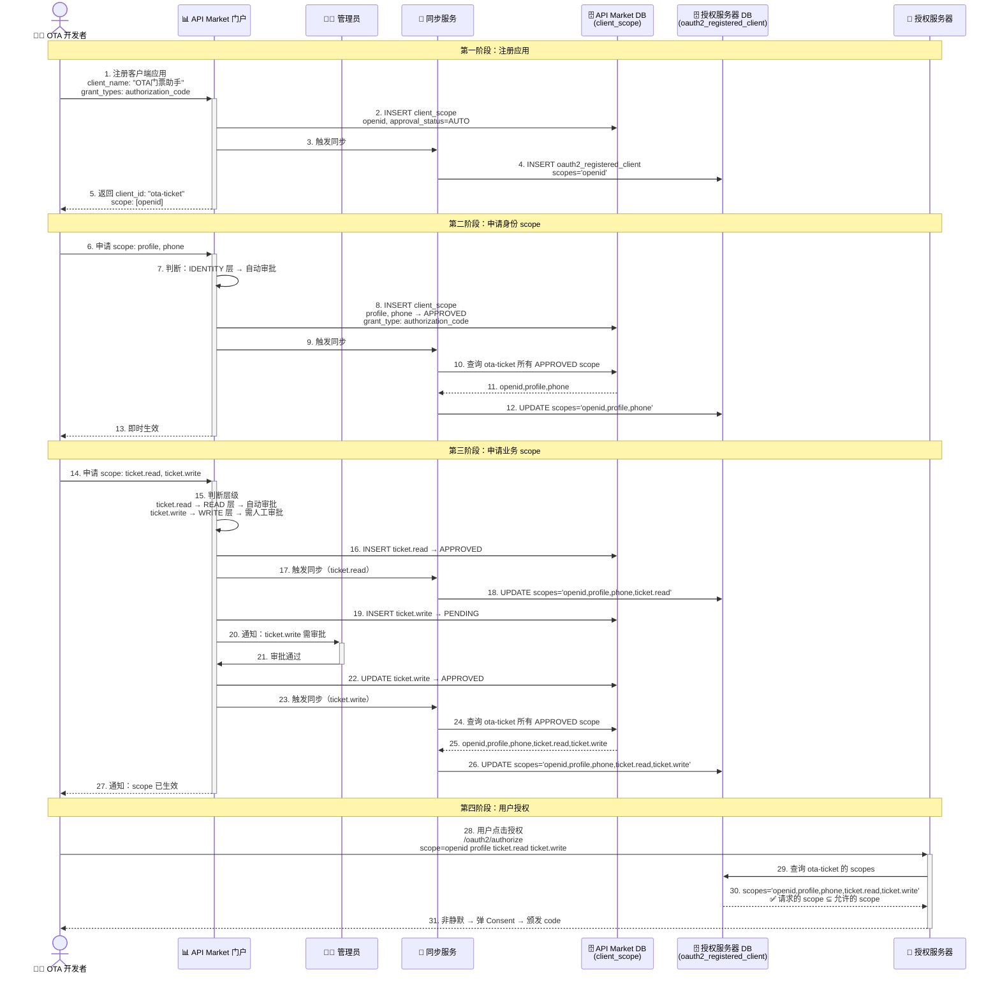

# Scope 体系设计方案

## 业务背景

我司是一家 TOC 业务的公司**主题乐园**，涉及的业务有年卡、门票、游园、会员、订单、预约、核销、个人中心等等。
其他第三方平台对接来对接，可能会获取用户信息，门票信息等。

## 技术背景

我司现有架构体系：TYK 网关平台，正在搭建的 API Market 平台，授权服务（基于 Spring Authorization Server）。

## 调研结论摘要

### 核心结论

1. **静默授权是 TOC 平台刚需**：微信和支付宝的模式证明了"先静默识别、再显式授权"是最优实践
2. **读写分离适合业务 API**：京东的 `业务域.操作类型` 模式命名可预测、权限控制精确
3. **Consent 三状态优化体验**：抖音的"必选/默认勾选/默认不选"让授权页更贴近业务场景
4. Scope最小化 + 分层授权 + 动态申请 + 人工审核
5. 应用默认仅获得基础scope，高级scope必须单独申请
6. 所有权限申请，变更，授权记录全链路日志保存
7. 区分【自动通过】【人工审核】，适配不同安全等级
8. **双轨 Scope**：用户相关（用户委托）与非用户相关（应用身份）**拆分命名与审批链路**，网关按 API 的「委托类型」与 scope 同时校验，避免混用 token

---

## 双轨模型概述（用户相关 API vs 非用户相关 API）

本方案将可调用的开放能力分为两条**互不替代**的轨道；二者可复用同一套微服务与领域模型，但 **Scope 字符串、OAuth Grant、审批对象、路由前缀**不同。

| 轨道 | 面向对象 | OAuth Grant | 是否需要用户 Consent | Scope 命名空间 | 典型 token `sub` | 典型 API 路由前缀（示例） |
|------|----------|-------------|----------------------|----------------|-------------------|---------------------------|
| **用户相关（USER）** | 第三方应用**代表登录用户**调用乐园「用户上下文」能力 | `authorization_code`（建议 PKCE） | 需要（静默仅限 `openid`） | 身份：`openid` 等；业务：**`{业务域}.{read\|write}`** | 用户标识 | `/api/b2c/**` |
| **非用户相关（APP）** | 合作方系统、闸机、内部作业等**不绑定当前 C 端用户**的调用 | `client_credentials` | 不需要（平台对客户端准入与授权） | **无身份 scope**；业务：**`partner.{业务域}.{read\|write}`** | 客户端标识（或平台约定的服务主体） | `/api/partner/**` |

**设计要点**：

1. **禁止混用字符串**：`ticket.read` **仅**出现在用户委托访问令牌中；合作方读门票使用 **`partner.ticket.read`**。网关与 SAS 在签发/校验时不会因「同名不同义」产生歧义。
2. **客户端形态**：推荐为同一合作伙伴拆分 **「用户端应用」（小程序/H5，走 USER）** 与 **「服务端应用」（合作方后台/闸机，走 APP）** 两个 Registered Client；若必须合一，则 `registered_client.scopes` 内**同时包含**两类前缀的 scope，但 **token 换取请求仍按 grant 限制**（`client_credentials` 不得请求 `openid` / `ticket.*` 等 USER 业务 scope）。
3. **申请与审批**：USER 轨道需兼顾**个人信息保护与用户同意**；APP 轨道以**合同范围、系统归属、风控**为主；二者可在控制台共用「能力目录」，但 **`client_scope.delegation`（或等价字段）必须标 USER / APP**，审批模板可不同。
4. **资源服务**：除 scope 与路由外，USER 访问必须以 **`sub`（用户）**做数据范围隔离；PARTNER 访问以 **client_id / 租户 / 合同授权边界**做隔离——**不得以 scope 同名代替数据鉴权**。

---

## Scope 命名规范

### 命名格式

**用户身份 Scope**（借鉴微信 `snsapi_` 前缀、支付宝 `auth_` 前缀）：

```
<身份域>
```

无点分、无操作后缀。身份 scope 是特殊的存在，不遵循业务域规则；**仅属于用户相关轨道**，禁止出现在 `client_credentials` 请求中。

**用户委托类业务 Scope（用户相关 API）**（借鉴京东 `业务域.操作类型`）：

```
<业务域>.<操作类型>
```

- **业务域**：小写英文 + 连字符（多词用连字符），对应一组相关 API 资源
- **操作类型**：`read`（读取）或 `write`（写入/创建/删除/核销）
- **分隔符**：点号 `.`

**应用身份类业务 Scope（非用户相关 API）**：

```
partner.<业务域>.<操作类型>
```

- 固定前缀 **`partner.`** 表示「应用身份 / 合作方系统」轨道，与 C 端用户委托区分
- **`业务域`、操作类型**与用户委托类保持一致，便于审批目录与文档对照（例如用户侧 `order.read` ↔ 合作方 `partner.order.read`）

### 命名规则

| 规则 | 说明 | 示例 |
|------|------|------|
| 身份 scope 特殊命名 | 不遵循业务域规则，单独定义 | `openid`、`profile`、`phone` |
| USER / APP 命名分轨 | 用户委托业务不用前缀；应用身份业务固定 `partner.` 前缀 | `ticket.read` / `partner.ticket.read` |
| 业务域对应微服务 | 一个微服务对应一个业务域 | `ticket-service` → `ticket.*` 与 `partner.ticket.*` |
| 多词业务域用连字符 | 保持可读性 | `annual-card.read`、`partner.annual-card.read` |
| 读写严格分离 | 读取用 `.read`，写入/创建/删除用 `.write` | `order.read` / `partner.order.write` |
| 只读资源无 write | 如果业务域只有查询接口 | `park.read`、`partner.park.read` |
| 禁止超细粒度 | 不拆到字段级别 | ✅ `ticket.read` ❌ `ticket.price.read` |
| 禁止超粗粒度 | 不使用 `all`、`*` 等通配 scope | ❌ `api.all` ❌ `*` |

### 命名对比

```
❌ 不好的命名                         ✅ 好的命名（本方案）
─────────────────────────────         ─────────────────────────────
snsapi_base            (微信风格)      openid
auth_user              (支付宝风格)     profile
user_info              (太粗)          profile + 业务 USER scope
ticket                 (无操作)        ticket.read / partner.ticket.read
annualcard_read        (无分隔)        annual-card.read
ticket.price.read      (太细)          ticket.read
api.all                (太危险)        按业务域逐个分配
```

---

## Scope 完整清单

### 1. 用户身份 Scope（仅用户相关轨道 / authorization_code）

| Scope | 说明 | 是否静默 | 映射 API | 对标平台 |
|-------|------|----------|----------|----------|
| `openid` | 获取用户唯一标识（sub/openid），不弹窗 | ✅ 静默 | `GET /userinfo`（仅返回 sub） | 微信 `snsapi_base` / 支付宝 `auth_base` |
| `profile` | 获取用户基本信息（昵称、头像等），弹窗确认 | ❌ 非静默 | `GET /userinfo`（返回 sub + 昵称 + 头像） | 微信 `snsapi_userinfo` / 支付宝 `auth_user` |
| `phone` | 获取用户手机号，弹窗确认 | ❌ 非静默 | `GET /user/phone` | 微信小程序 `scope.phone` |
| `email` | 获取用户邮箱，弹窗确认 | ❌ 非静默 | `GET /user/email` | 百度 `email` |

**静默授权规则**：



| 场景 | 请求 scope | 是否弹窗 | token 中获得 |
|------|-----------|----------|-------------|
| 静默识别用户 | `openid` | ❌ 不弹窗 | 仅 sub |
| 获取用户信息 | `openid profile` | ✅ 弹窗 | sub + 昵称 + 头像 |
| 获取手机号 | `openid phone` | ✅ 弹窗 | sub + 手机号 |
| 完整授权 | `openid profile phone ticket.read` | ✅ 弹窗 | 全部信息 + 业务权限 |

> **关键规则**：`openid` 是静默 scope，请求中**只有** `openid` 时不弹 Consent 页，直接返回授权码。只要包含任何非静默 scope，就必须弹 Consent 页。`openid` 在所有 authorization_code 流程中**自动包含**，无需显式请求。

### 2. 用户委托类业务 Scope（用户相关 API / 仅 authorization_code）

> **仅用于** `authorization_code` 换取的访问令牌；**必须通过 Consent**（静默场景除外），且资源访问以 **用户 `sub`** 为数据边界。路由建议使用 B2C 前缀（示例：`/api/b2c/**`）。

#### 2.1 门票业务域

| Scope | 说明 | 映射 API 示例 | 典型使用者 |
|-------|------|---------------|-----------|
| `ticket.read` | 查询门票信息、门票列表（面向当前登录用户/会话场景） | `GET /api/b2c/tickets/**` | OTA / 小程序展示购票 |
| `ticket.write` | 购买/退票/修改门票（用户发起） | `POST /api/b2c/tickets`, `PUT /api/b2c/tickets/**` | OTA 代用户下单 |

#### 2.2 年卡业务域

| Scope | 说明 | 映射 API 示例 | 典型使用者 |
|-------|------|---------------|-----------|
| `annual-card.read` | 查询年卡信息、年卡权益 | `GET /api/b2c/annual-cards/**` | 会员中心 |
| `annual-card.write` | 购买/续费/激活年卡 | `POST /api/b2c/annual-cards`, `PUT /api/b2c/annual-cards/**` | 代办年卡 |

#### 2.3 订单业务域

| Scope | 说明 | 映射 API 示例 | 典型使用者 |
|-------|------|---------------|-----------|
| `order.read` | 查询**当前用户**订单与状态 | `GET /api/b2c/orders/**` | 用户订单列表、追踪 |
| `order.write` | 创建/取消**与用户关联**的订单 | `POST /api/b2c/orders`, `PUT /api/b2c/orders/**` | 代下单、退款发起 |

#### 2.4 预约业务域

| Scope | 说明 | 映射 API 示例 | 典型使用者 |
|-------|------|---------------|-----------|
| `reservation.read` | 查询当前用户预约 | `GET /api/b2c/reservations/**` | 预约查询 |
| `reservation.write` | 创建/取消预约 | `POST /api/b2c/reservations`, `PUT /api/b2c/reservations/**` | 代预约 |

#### 2.5 核销业务域（用户场景）

| Scope | 说明 | 映射 API 示例 | 典型使用者 |
|-------|------|---------------|-----------|
| `verification.read` | 用户侧核销记录/凭证查询 | `GET /api/b2c/verifications/**` | 用户自查 |
| `verification.write` | 用户触发的核销相关写操作（若业务需开放） | `POST /api/b2c/verifications/**` | 限定场景 |

> **说明**：闸机、园方后台批量核销等 **无用户在场** 的高危能力应放在 **应用身份轨道**（`partner.verification.*` + `/api/partner/**`），勿与 C 端用户 scope 混用。

#### 2.6 会员业务域

| Scope | 说明 | 映射 API 示例 | 典型使用者 |
|-------|------|---------------|-----------|
| `member.read` | 查询当前用户会员、积分、等级 | `GET /api/b2c/members/**` | 个人中心 |
| `member.write` | 变更当前用户会员资料、积分（经业务规则） | `PUT /api/b2c/members/**`, `POST /api/b2c/members/points/**` | 积分兑换 |

#### 2.7 游园业务域（只读）

| Scope | 说明 | 映射 API 示例 | 典型使用者 |
|-------|------|---------------|-----------|
| `park.read` | 个性化游园信息、推荐（若需登录态） | `GET /api/b2c/park/**` | 导览小程序 |

> 纯公开静态信息若完全匿名，也可不走 token；一旦纳入开放平台收费或控量，建议仍通过 **APP 轨道的 `partner.park.read`** 发 token。

#### 2.8 支付业务域

| Scope | 说明 | 映射 API 示例 | 典型使用者 |
|-------|------|---------------|-----------|
| `payment.read` | 查询当前用户支付记录 | `GET /api/b2c/payments/**` | 用户账单 |
| `payment.write` | 发起支付、退款（用户上下文） | `POST /api/b2c/payments/charge`, `POST /api/b2c/payments/refund` | 收银台 |

#### 2.9 通知业务域

| Scope | 说明 | 映射 API 示例 | 典型使用者 |
|-------|------|---------------|-----------|
| `notification.read` | 读取当前用户通知 | `GET /api/b2c/notifications/**` | 消息中心 |
| `notification.write` | 通知状态回写等 | `POST /api/b2c/notifications/**` | 端上回调 |

### 3. 应用身份类业务 Scope（非用户相关 API / 仅 client_credentials）

> **仅用于** `client_credentials` 换取的访问令牌；**无** `openid`/`profile` 等身份 scope；不经过用户 Consent。路由建议使用合作方前缀（示例：`/api/partner/**`），资源访问以 **client_id、租户、合同授权** 为边界，而非终端用户 `sub`。

下列与上一节 **逐域对称**，前缀固定为 `partner.`，避免与用户委托 scope 同名。

#### 3.1—3.9 对称清单（合作方 / 系统）

| 业务域 | Scope | 说明 | 映射 API 示例 | 典型使用者 |
|--------|-------|------|---------------|-----------|
| 门票 | `partner.ticket.read` | 合作方查询可售库存、价格体系等 | `GET /api/partner/tickets/**` | OTA 供应链、查价 |
| 门票 | `partner.ticket.write` | 合作方批量上下架、锁票等（按合同） | `POST /api/partner/tickets/**` | 渠道运营系统 |
| 年卡 | `partner.annual-card.read` | 合作方查询年卡SKU、权益规则 | `GET /api/partner/annual-cards/**` | 会员渠道 |
| 年卡 | `partner.annual-card.write` | 合作方受理年卡业务（按合同） | `POST /api/partner/annual-cards/**` | B2B 受理 |
| 订单 | `partner.order.read` | 合作方按授权范围查询订单/对账 | `GET /api/partner/orders/**` | 财务对账、履约 |
| 订单 | `partner.order.write` | 合作方下单、退货（系统间） | `POST /api/partner/orders/**` | B2B 下单对接 |
| 预约 | `partner.reservation.read` / `partner.reservation.write` | 渠道侧预约查询与写入 | `GET/POST /api/partner/reservations/**` | 渠道中心 |
| 核销 | `partner.verification.read` | 核销审计、记录拉取 | `GET /api/partner/verifications/**` | 风控、对账 |
| 核销 | `partner.verification.write` | **闸机/线下设备核销**、补核销等 | `POST /api/partner/verifications/verify` | 闸机、园方作业 |
| 会员 | `partner.member.read` / `partner.member.write` | 合作方会员批量画像、积分运营（合同内） | `GET/POST /api/partner/members/**` | CRM、联合运营 |
| 游园 | `partner.park.read` | 导览数据、排队等对外公开数据（控量计费） | `GET /api/partner/park/**` | 大屏、三方导览 |
| 支付 | `partner.payment.read` / `partner.payment.write` | 商户对账、退款、分账（按支付合规） | `GET/POST /api/partner/payments/**` | 财务、支付机构 |
| 通知 | `partner.notification.read` / `partner.notification.write` | 系统向合作方投递或拉取通知 | `/api/partner/notifications/**` | 消息中台 |

### 4. Scope 全景一览

```
┌─────────────────────────────────────────────────────────────────────────┐
│     用户相关轨道（USER / authorization_code）                              │
├─────────────────────────────────────────────────────────────────────────┤
│  身份 Scope (IDENTITY)                                                   │
│  openid（静默） profile phone email                                     │
│                                                                          │
│  用户委托类业务 (B2C 示例前缀 /api/b2c/)                                   │
│  ticket.* annual-card.* order.* reservation.* verification.*            │
│  member.* park.* payment.* notification.*                                │
└─────────────────────────────────────────────────────────────────────────┘

┌─────────────────────────────────────────────────────────────────────────┐
│     非用户相关轨道（APP / client_credentials）                             │
├─────────────────────────────────────────────────────────────────────────┤
│  无身份 scope                                                            │
│                                                                          │
│  应用身份类业务 partner.*（Partner 示例前缀 /api/partner/）                  │
│  partner.ticket.* partner.annual-card.* partner.order.*                  │
│  partner.reservation.* partner.verification.* partner.member.*           │
│  partner.park.* partner.payment.* partner.notification.*                 │
└─────────────────────────────────────────────────────────────────────────┘
```

---

## Scope 分层模型（四层）



| 层级 | 轨道 | 审批要求 | 是否静默 | 典型场景 |
|------|------|----------|----------|----------|
| ⚪ 隐式 | USER | 无需申请，自动包含（授权码客户端） | ✅ 仅 `openid` | 小程序静默识别 |
| 🟢 身份 | USER | 申请，多自动审批 | ❌ Consent | 拉取昵称、手机号 |
| 🟡 读取 | USER | READ 层规则 | ❌ Consent | 用户查本人订单/门票 |
| 🔴 写入 | USER | WRITE 多人工审核 | ❌ Consent | 用户发起购票、退款 |
| 🟡 读取 | APP | 合同 + 快速审批 | N/A（无 Consent） | 渠道查价、对账拉单 |
| 🔴 写入 | APP | 人工高优 | N/A | 闸机核销、渠道锁票 |

> **说明**：APP 轨道不存在「静默授权」概念；其风险控制前移为 **client 审核、IP 白名单、额度、密钥轮换** 等。

---

## 两种授权模式下的 Scope 使用



| 维度 | authorization_code（USER） | client_credentials（APP） |
|------|-------------------|-------------------|
| **适用场景** | 第三方代表**登录用户**（小程序、H5 购票） | 合作方系统、闸机、对账，**无当前用户在场** |
| **身份 scope** | ✅ `openid`、`profile`、`phone`、`email` | ❌ **禁止**出现在 token 请求中 |
| **业务 scope** | ✅ `ticket.read` 等 **不含 `partner.` 前缀** | ✅ **仅** `partner.*` |
| **是否弹 Consent 页** | 视是否仅 `openid` 而定 | 不需要 |
| **token `sub`** | 用户标识 | 客户端/服务主体标识（由授权服务器约定） |
| **典型路由** | `/api/b2c/**` | `/api/partner/**` |

### 主题乐园典型场景

| 场景 | 授权模式 | Scope | 说明 |
|------|----------|-------|------|
| 小程序静默登录 | authorization_code | `openid` | 静默识别用户 |
| OTA 代用户购票 | authorization_code | `openid profile ticket.read ticket.write` | 用户 Consent 后代下单 |
| 合作方系统对账/拉单 | client_credentials | `partner.order.read` | 无用户 Consent，合同 + client 审核 |
| 闸机核销系统 | client_credentials | `partner.verification.read` `partner.verification.write` | 设备与服务账号，高危写入强审批 |
| 会员积分（个人中心） | authorization_code | `openid member.read member.write` | 用户本人积分 |

---

## Consent 页设计（借鉴抖音三状态）

当授权请求包含非静默 scope 时，弹出 Consent 页。参考抖音的三种权限勾选状态：



| 勾选状态 | 适用 scope | 用户体验 | 主题乐园场景 |
|----------|-----------|----------|-------------|
| **必选，不可取消** | `openid` | 灰色勾选，不可操作 | 身份识别是最基础需求 |
| **默认勾选，可取消** | `profile`、`*.read` | 勾选状态，可取消 | 查门票价格、查游园信息等低风险操作 |
| **默认不选，需勾选** | `phone`、`email`、`*.write` | 未勾选状态，需主动勾选 | 手机号、购票/核销/退款等敏感操作 |

---

## 网关 + API Market 架构下的 Scope 校验

> 详细架构图解见 [api-market-gateway-scope-diagrams](api-market-gateway-scope-diagrams.md)

### 核心架构



### 各组件职责

| 组件 | 验证 JWT 签名 | 验证 scope | 维护 scope 规则 | 说明 |
|------|:---:|:---:|:---:|------|
| 授权服务器 | ✅ 颁发时 | ✅ **第一道关卡** | ❌ | 管「请求的 scope ⊆ registered_client.scopes」，并在 **`client_credentials`** 时拒绝 USER 轨 scope / 身份 scope |
| TYK 网关 | ✅ | ✅ **第二道+** | ❌ | 管「token scope ⊇ API 所需 scope」**且**「USER 轨 API 不得使用 `client_credentials` token」等委托规则 |
| 资源服务器 | ✅ | ❌ | ❌ | 只验签名，scope 校验已由网关完成 |
| API Market | ❌ | ❌ | ✅ **核心** | 数据源：定义"哪个 API 需要什么 scope" |

### 为什么需要「两道 scope + 委托轨道」关卡

系统中存在**授权服务器上的准入**与**网关上的消费侧校验**，二者针对不同问题；**双轨模型下还需校验「轨道一致」**。

| | 第一道：授权服务器（`registered_client.scopes` + grant 约束） | 第二道：TYK 网关（API Market：`scope` + `delegation`） |
|---|---|---|
| **校验时机** | 颁发 token **之前** | 每次 API 调用 |
| **校验什么** | 客户端**能不能请求**这些 scope；`client_credentials` **不得**请求 `openid`/`ticket.*` 等 USER 业务 scope | token **是否含有所需 scope**；**API 的 `delegation`（USER/APP）是否与 token 来源一致**（例如 USER 轨 API 需 `authorization_code` 签发） |
| **失败结果** | `invalid_scope` / 拒绝换票 | `403`（`insufficient_scope` / `invalid_token` 等） |
| **管的问题** | token 里**能写什么**、grant 与 scope **能否组合** | 凭据**能进哪类路由**、是否**越权调用另一类 API** |

**去掉第一道（不同步到授权服务器）的后果**：

若 `partner.order.read` 未写入 `oauth2_registered_client.scopes`，合作方在 `/oauth2/token`（`client_credentials`）阶段即失败，**拿不到**带该 scope 的 token。

**去掉第二道（网关不校验 scope / 不校验委托类型）的后果**：

- 仅凭 `order.read` 无法区分应走 B2C 还是 Partner，若路由曾经混用，可能出现**用错误轨道 token 访问错误资源范围**的风险（scope 字符串已分离为 `order.read` vs `partner.order.read`，网关必须校验 **scope + 路由前缀/ `delegation`**）。

**典型场景——用户只同意了部分 USER scope**：

```
客户端请求 scope=openid order.read order.write
  → 第一道（AS）：二者均在 registered_client.scopes 中 → 进入 Consent
  → 用户只同意 order.read
  → access_token scope: openid order.read
  → POST /api/b2c/orders 需要 order.write
  → 网关：❌ 403 insufficient_scope
```

> **同步的本质**：把 API Market 的审批结果写入 `oauth2_registered_client.scopes`；**USER 与 APP 的 scope 分轨命名**，避免审批与运行时语义漂移。

---

## Scope 与 API 的映射规则

### 数据模型



### 映射示例

**scope_definition**

| id | scope_name | description | scope_category | delegation | scope_level | business_domain | is_silent | consent_default |
|----|-----------|-------------|----------------|------------|-------------|-----------------|-----------|----------------|
| 0 | openid | 用户唯一标识 | IDENTITY | IDENTITY | IMPLICIT | - | true | REQUIRED |
| 1 | profile | 用户基本信息 | IDENTITY | IDENTITY | IDENTITY | - | false | CHECKED |
| 2 | phone | 用户手机号 | IDENTITY | IDENTITY | IDENTITY | - | false | UNCHECKED |
| 3 | email | 用户邮箱 | IDENTITY | IDENTITY | IDENTITY | - | false | UNCHECKED |
| 4 | ticket.read | 查询门票（用户委托） | BUSINESS_USER | USER | READ | ticket | false | CHECKED |
| 5 | ticket.write | 购买/退票（用户委托） | BUSINESS_USER | USER | WRITE | ticket | false | UNCHECKED |
| 6 | annual-card.read | 查询年卡（用户委托） | BUSINESS_USER | USER | READ | annual-card | false | CHECKED |
| 7 | annual-card.write | 购买/续费年卡（用户委托） | BUSINESS_USER | USER | WRITE | annual-card | false | UNCHECKED |
| 8 | order.read | 查询订单（用户委托） | BUSINESS_USER | USER | READ | order | false | CHECKED |
| 9 | order.write | 创建/取消订单（用户委托） | BUSINESS_USER | USER | WRITE | order | false | UNCHECKED |
| 10 | reservation.read | 查询预约（用户委托） | BUSINESS_USER | USER | READ | reservation | false | CHECKED |
| 11 | reservation.write | 创建/取消预约（用户委托） | BUSINESS_USER | USER | WRITE | reservation | false | UNCHECKED |
| 12 | verification.read | 用户侧核销查询 | BUSINESS_USER | USER | READ | verification | false | CHECKED |
| 13 | verification.write | 用户侧核销写 | BUSINESS_USER | USER | WRITE | verification | false | UNCHECKED |
| 14 | member.read | 查询会员（用户委托） | BUSINESS_USER | USER | READ | member | false | CHECKED |
| 15 | member.write | 会员/积分（用户委托） | BUSINESS_USER | USER | WRITE | member | false | UNCHECKED |
| 16 | park.read | 游园信息（用户轨） | BUSINESS_USER | USER | READ | park | false | CHECKED |
| 17 | payment.read | 查询支付（用户委托） | BUSINESS_USER | USER | READ | payment | false | CHECKED |
| 18 | payment.write | 发起支付/退款（用户委托） | BUSINESS_USER | USER | WRITE | payment | false | UNCHECKED |
| 19 | notification.read | 读取通知（用户委托） | BUSINESS_USER | USER | READ | notification | false | CHECKED |
| 20 | notification.write | 写入通知（用户委托） | BUSINESS_USER | USER | WRITE | notification | false | UNCHECKED |
| 21 | partner.ticket.read | 查询门票（应用身份） | BUSINESS_APP | APP | READ | ticket | false | N_A |
| 22 | partner.ticket.write | 上下架/锁票等（应用身份） | BUSINESS_APP | APP | WRITE | ticket | false | N_A |
| 23 | partner.annual-card.read | 查询年卡规则（应用身份） | BUSINESS_APP | APP | READ | annual-card | false | N_A |
| 24 | partner.annual-card.write | 年卡受理（应用身份） | BUSINESS_APP | APP | WRITE | annual-card | false | N_A |
| 25 | partner.order.read | 查询/对账订单（应用身份） | BUSINESS_APP | APP | READ | order | false | N_A |
| 26 | partner.order.write | 系统间下单/退单（应用身份） | BUSINESS_APP | APP | WRITE | order | false | N_A |
| 27 | partner.reservation.read | 预约查询（应用身份） | BUSINESS_APP | APP | READ | reservation | false | N_A |
| 28 | partner.reservation.write | 预约写入（应用身份） | BUSINESS_APP | APP | WRITE | reservation | false | N_A |
| 29 | partner.verification.read | 核销记录拉取（应用身份） | BUSINESS_APP | APP | READ | verification | false | N_A |
| 30 | partner.verification.write | 闸机核销等（应用身份） | BUSINESS_APP | APP | WRITE | verification | false | N_A |
| 31 | partner.member.read | 会员批量查询（应用身份） | BUSINESS_APP | APP | READ | member | false | N_A |
| 32 | partner.member.write | 会员批量运营（应用身份） | BUSINESS_APP | APP | WRITE | member | false | N_A |
| 33 | partner.park.read | 游园公开数据（应用身份） | BUSINESS_APP | APP | READ | park | false | N_A |
| 34 | partner.payment.read | 支付对账（应用身份） | BUSINESS_APP | APP | READ | payment | false | N_A |
| 35 | partner.payment.write | 支付指令（应用身份） | BUSINESS_APP | APP | WRITE | payment | false | N_A |
| 36 | partner.notification.read | 通知拉取（应用身份） | BUSINESS_APP | APP | READ | notification | false | N_A |
| 37 | partner.notification.write | 通知投递（应用身份） | BUSINESS_APP | APP | WRITE | notification | false | N_A |

**api_definition**（示例：`delegation` 必须与 `api_path` 前缀、绑定的 scope `delegation` 一致；其余域按同构扩展）

| id | api_name | api_path | http_method | service_id | delegation |
|----|----------|----------|-------------|------------|------------|
| 1 | 用户身份 | `/api/b2c/userinfo` | GET | user-service | USER |
| 2 | 用户手机号 | `/api/b2c/user/phone` | GET | user-service | USER |
| 3 | 门票列表(B2C) | `/api/b2c/tickets/**` | GET | ticket-service | USER |
| 4 | 购买门票(B2C) | `/api/b2c/tickets` | POST | ticket-service | USER |
| 5 | 退票(B2C) | `/api/b2c/tickets/*/refund` | POST | ticket-service | USER |
| 6 | 年卡信息(B2C) | `/api/b2c/annual-cards/**` | GET | annual-card-service | USER |
| 7 | 购买年卡(B2C) | `/api/b2c/annual-cards` | POST | annual-card-service | USER |
| 8 | 订单查询(B2C) | `/api/b2c/orders/**` | GET | order-service | USER |
| 9 | 创建订单(B2C) | `/api/b2c/orders` | POST | order-service | USER |
| 10 | 预约查询(B2C) | `/api/b2c/reservations/**` | GET | reservation-service | USER |
| 11 | 创建预约(B2C) | `/api/b2c/reservations` | POST | reservation-service | USER |
| 12 | 核销(B2C) | `/api/b2c/verifications/**` | POST | verification-service | USER |
| 13 | 核销记录(B2C) | `/api/b2c/verifications/**` | GET | verification-service | USER |
| 14 | 会员信息(B2C) | `/api/b2c/members/**` | GET | member-service | USER |
| 15 | 积分操作(B2C) | `/api/b2c/members/points/**` | POST | member-service | USER |
| 16 | 游园信息(B2C) | `/api/b2c/park/**` | GET | park-service | USER |
| 17 | 发起支付(B2C) | `/api/b2c/payments/charge` | POST | payment-service | USER |
| 18 | 退款(B2C) | `/api/b2c/payments/refund` | POST | payment-service | USER |
| 101 | 门票列表(Partner) | `/api/partner/tickets/**` | GET | ticket-service | APP |
| 102 | 购买/库存(Partner) | `/api/partner/tickets/**` | POST | ticket-service | APP |
| 103 | 订单查询(Partner) | `/api/partner/orders/**` | GET | order-service | APP |
| 104 | 订单写入(Partner) | `/api/partner/orders/**` | POST | order-service | APP |
| 105 | 核销执行(Partner) | `/api/partner/verifications/verify` | POST | verification-service | APP |
| 106 | 游园信息(Partner) | `/api/partner/park/**` | GET | park-service | APP |

**api_scope**

| id | api_id | scope_id | require_type | 说明 |
|----|--------|----------|-------------|------|
| 1 | 1 | 0 | ALL | `/api/b2c/userinfo` 至少需要 openid |
| 2 | 1 | 1 | ANY | 有 profile 则返回更多信息 |
| 3 | 2 | 2 | ALL | 手机号必须 phone scope |
| 4 | 3 | 4 | ALL | B2C 门票列表需要 ticket.read |
| 5 | 4 | 5 | ALL | B2C 购票需要 ticket.write |
| 6 | 5 | 5 | ALL | B2C 退票需要 ticket.write |
| 7 | 6 | 6 | ALL | |
| 8 | 7 | 7 | ALL | |
| 9 | 8 | 8 | ALL | |
| 10 | 9 | 9 | ALL | |
| 11 | 10 | 10 | ALL | |
| 12 | 11 | 11 | ALL | |
| 13 | 12 | 13 | ALL | 用户侧写操作（依实际拆分） |
| 14 | 13 | 12 | ALL | |
| 15 | 14 | 14 | ALL | |
| 16 | 15 | 15 | ALL | |
| 17 | 16 | 16 | ALL | |
| 18 | 17 | 18 | ALL | |
| 19 | 18 | 18 | ALL | |
| 30 | 101 | 21 | ALL | Partner 门票读需要 partner.ticket.read |
| 31 | 102 | 22 | ALL | Partner 门票写需要 partner.ticket.write |
| 32 | 103 | 25 | ALL | Partner 订单读需要 partner.order.read |
| 33 | 104 | 26 | ALL | Partner 订单写需要 partner.order.write |
| 34 | 105 | 30 | ALL | Partner 核销写需要 partner.verification.write |
| 35 | 106 | 33 | ALL | Partner 游园公开数据需要 partner.park.read |

---

## Scope 校验规则

### 网关校验逻辑（伪代码）

```java
// 网关 ScopeAuthorizationFilter + 委托轨道（伪代码）
public boolean checkScope(HttpServletRequest request, Jwt jwt) {
    String path = request.getRequestURI();       // /api/b2c/tickets/...
    String method = request.getMethod();         // GET

    ApiEndpointMeta api = apiMarketService.resolve(path, method);
    // → 所需 scope 列表、delegation=USER | APP、grant 期望=authorization_code | client_credentials

    if (api.getRequiredScopes().isEmpty()) {
        return true;
    }

    // 令牌轨道与 API 轨道一致：如 USER 轨 API 应使用 authorization_code 签发的访问令牌
    if (!delegationMatches(jwt, api.getDelegation(), api.getExpectedGrant())) {
        return false;
    }

    Set<String> tokenScopes = jwt.getClaimAsStringList("scope");
    return matchScopes(tokenScopes, api.getRequiredScopes(), api.getRequireType());
}
```

> **实现提示**：`delegationMatches` 可读 `grant_type`（由 SAS 写入 JWT 自定义 claim）或 `authorized_party` / `token_use` 等**你们统一约定**的字段；**不要**仅靠 `sub` 是否像 UUID 来推断。

### 授权服务器静默判断逻辑

```java
// 授权服务器判断是否需要弹出 Consent 页
public boolean requiresConsent(Set<String> requestedScopes) {
    // openid 是隐式 scope，自动包含
    // 只有 openid → 静默，不需要 Consent
    Set<String> nonImplicitScopes = requestedScopes.stream()
        .filter(s -> !s.equals("openid"))
        .collect(Collectors.toSet());

    return !nonImplicitScopes.isEmpty();
}
```

### 校验规则明细

| 规则 | 说明 | 示例 |
|------|------|------|
| **静默判断** | 只有 `openid` 时不弹 Consent，直接返回 code | scope=`openid` → 静默 |
| **非静默判断** | 包含任何非 `openid` 的 scope 时弹 Consent | scope=`openid profile` → 弹窗 |
| **openid 自动包含** | authorization_code 流程中 `openid` 始终在 token 中 | 即使不显式请求也会包含 |
| **read 不包含 write（同轨）** | `ticket.read` 不能替代 `ticket.write`；`partner.*` 同理 | 读写 scope 分离 |
| **身份 scope 仅限 USER 轨** | `profile`、`phone`、`email` 只能通过 `authorization_code` 进入 token | `client_credentials` 拒绝 |
| **业务 scope 分轨** | `ticket.*` 仅 USER；`partner.ticket.*` 仅 APP | 禁止交叉换票 |
| **openid 无用户业务权限** | `openid` 仅用户身份/最小 userinfo | 不能访问 `/api/b2c/tickets/**` |
| **未配置 scope 的 API** | API Market 无记录 | 默认拒绝或显式标记公开（二选一） |

---

## 完整授权流程时序图



---

## 客户端 Scope 申请与审批流程

### 两层存储模型

客户端的 scope 信息涉及**两层存储**，必须协同工作：

| 存储位置 | 表 | 存什么 | 谁写入 | 何时写入 |
|----------|-----|--------|--------|----------|
| API Market 数据库 | `client_scope` | 客户端申请的 scope + 审批状态 | API Market 门户 | 开发者申请时 |
| 授权服务器数据库 | `oauth2_registered_client.scopes` | 客户端被允许的 scope 列表（逗号分隔字符串） | 同步服务 | scope 审批通过/收回时 |

#### 第一层：API Market — `client_scope` 表（管理侧）

管理"客户端能申请哪些 scope"及审批状态：

```sql
-- API Market 数据库
CREATE TABLE client_scope (
    id              BIGINT PRIMARY KEY,
    client_id       VARCHAR(100) NOT NULL,      -- 客户端标识
    scope_id        BIGINT NOT NULL,            -- → scope_definition.id
    delegation      VARCHAR(20),                -- USER / APP：该 scope 归属哪条轨道
    approval_status VARCHAR(20),                -- AUTO / PENDING / APPROVED / REJECTED
    created_at      TIMESTAMP,
    approved_at     TIMESTAMP
);
```

示例数据：

| id | client_id | scope_id | delegation | approval_status |
|----|-----------|----------|------------|----------------|
| 1 | ota-ticket | 0 (openid) | USER | AUTO |
| 2 | ota-ticket | 1 (profile) | USER | APPROVED |
| 3 | ota-ticket | 4 (ticket.read) | USER | APPROVED |
| 4 | partner-order | 25 (partner.order.read) | APP | APPROVED |
| 5 | gate-system | 30 (partner.verification.write) | APP | APPROVED |

**作用**：API Market 门户管理审批流程，记录"谁申请了什么 scope、审批到哪一步"。

#### 第二层：授权服务器 — `oauth2_registered_client.scopes`（运行时）

Spring Authorization Server 原生使用 `oauth2_registered_client` 表的 `scopes` 列存储客户端**最终被允许的 scope 列表**：

```sql
-- 授权服务器数据库（SAS 原生表）
CREATE TABLE oauth2_registered_client (
    id                            VARCHAR(100) NOT NULL,
    client_id                     VARCHAR(100) NOT NULL,
    scopes                        VARCHAR(1000) NOT NULL,  -- ← 逗号分隔的 scope 字符串
    -- ... 其他字段
    PRIMARY KEY (id)
);
```

示例数据：

| client_id | scopes |
|-----------|--------|
| ota-ticket | `openid,profile,ticket.read,ticket.write` |

**核心规则**：SAS 在颁发 token 时验证 `请求的 scope ⊆ registered_client.scopes`；并在 **`client_credentials` 请求**中拒绝任何 **`delegation=USER`** 的 scope（含身份 scope）及 **无 `partner.` 前缀**的业务 scope；在 **`authorization_code` 请求**中可拒绝 **`delegation=APP`** 的 **`partner.*`**（若你们选择强分客户端，则相应 Registered Client 根本不注册 `partner.*`）。

```java
// OAuth2AuthorizationCodeRequestAuthenticationValidator.java
Set<String> requestedScopes = authentication.getScopes();      // 客户端请求的 scope
Set<String> allowedScopes = registeredClient.getScopes();      // 从 DB 读取该客户端被允许的 scope

if (!allowedScopes.containsAll(requestedScopes)) {
    throw new OAuth2AuthenticationException(OAuth2ErrorCodes.INVALID_SCOPE);
    // → 直接报错，不会进入后续授权流程
}
```

> **同步到 SAS 的前提**：API Market 审批通过后，`scope` 才会进入 `oauth2_registered_client.scopes`；未申请的 scope 在换 token 阶段即失败。

### 两层存储同步机制



**同步规则**：

| 时机 | 操作 |
|------|------|
| scope 审批通过 | 将该 client 所有 APPROVED 的 scope 拼接为逗号分隔字符串，更新到 `oauth2_registered_client.scopes` |
| scope 审批拒绝 | 不更新，该 scope 不会出现在 scopes 列表中 |
| scope 被收回 | 重新拼接 APPROVED 的 scope，更新到 `oauth2_registered_client.scopes` |
| 新增 scope | 追加到已有 scopes 字符串中，更新到 `oauth2_registered_client.scopes` |

### 未申请 scope 直接授权会被拒绝



### 完整申请与审批时序图



### Scope 存储全景

```
申请审批阶段:
  API Market client_scope 表 → (同步服务) → oauth2_registered_client.scopes

授权阶段:
  用户请求 scope → SAS 验证 ⊆ registered_client.scopes → 写入 oauth2_authorization.authorized_scopes

Token 颁发阶段:
  authorized_scopes → JWT scope claim（空格分隔）→ 网关提取校验

用户同意阶段:
  Consent 页确认 → oauth2_authorization_consent 表记录用户授权
```

| 阶段 | 存储位置 | 存什么 | 格式 |
|------|----------|--------|------|
| 申请审批 | `client_scope`（API Market） | 客户端申请的 scope + 审批状态 | 每行一个 scope |
| 同步生效 | `oauth2_registered_client.scopes`（授权服务器） | 客户端被允许的 scope 列表 | 逗号分隔字符串 |
| 授权记录 | `oauth2_authorization.authorized_scopes`（授权服务器） | 本次授权实际批准的 scope | 逗号分隔字符串 |
| 用户同意 | `oauth2_authorization_consent`（授权服务器） | 用户对某客户端的授权同意记录 | authorities 字段 |
| Token 携带 | JWT `scope` claim | token 中携带的 scope | 空格分隔字符串（OAuth 2.0 规范） |

---

## 典型第三方对接场景

### 场景1：OTA 平台代售门票

| 维度 | 说明 |
|------|------|
| **授权模式** | authorization_code |
| **申请的 scope** | `openid profile ticket.read ticket.write order.read` |
| **Consent 页** | ☑️ openid（必选）☑️ profile（默认勾选）☑️ ticket.read（默认勾选）☐ ticket.write（默认不选）☑️ order.read（默认勾选） |
| **审批层级** | ticket.write 需人工审核 |
| **用户感知** | 用户在 OTA 平台购票时，跳转授权页确认"允许OTA代购门票" |

### 场景2：闸机核销系统

| 维度 | 说明 |
|------|------|
| **授权模式** | `client_credentials` |
| **申请的 scope** | `partner.verification.read` `partner.verification.write`（及按需 `partner.ticket.read`） |
| **Consent 页** | 无 |
| **审批层级** | `partner.verification.write` 高敏人工审核 |
| **说明** | 仅服务端持有；路由走 `/api/partner/**` |

### 场景3：小程序静默登录 + 会员信息

| 维度 | 说明 |
|------|------|
| **授权模式** | authorization_code |
| **首次进入** | scope=`openid` → 静默，不弹窗，识别用户 |
| **点击"会员中心"** | scope=`openid profile member.read` → 弹 Consent，获取会员信息 |
| **审批层级** | member.read 自动审批 |

### 场景4：合作伙伴查询游园信息

| 维度 | 说明 |
|------|------|
| **授权模式** | `client_credentials` |
| **申请的 scope** | `partner.park.read` |
| **说明** | 公开类数据走应用身份轨控量计费；与用户轨 `park.read` 语义分离 |

---

## Scope 扩展性设计

### 新增业务域

```
新增业务域只需 3 步：

1. API Market 管理后台新增 **USER 与 APP** 两套 `scope_definition` 行，例如：
   INSERT INTO scope_definition (..., scope_name, ..., delegation)
   VALUES ('parking.read', ..., 'USER'), ('partner.parking.read', ..., 'APP');

2. 为新 API 配置 scope 映射：
   INSERT INTO api_scope (api_id, scope_id) VALUES (新API_id, parking.read_id);

3. 网关自动感知变更（通过消息总线刷新缓存）
   → 资源服务器零改动
```

### Scope 版本化

```
当 API 发生不兼容变更时，支持 scope 版本化：

v1 阶段：ticket.read, ticket.write
v2 阶段：ticket.read, ticket.write, ticket.v2.read, ticket.v2.write

- 旧客户端继续使用 v1 scope
- 新客户端申请 v2 scope
- 渐进式迁移，无强制切换
```

---

## 安全最佳实践

| 实践 | 说明 |
|------|------|
| **最小权限原则** | 客户端默认只有 `openid`，按需申请身份和业务 scope |
| **静默 scope 仅限 openid** | 只有 `openid` 可以静默授权，其他所有 scope 必须用户确认 |
| **write scope 需人工审核** | 所有 `.write` scope 必须人工审核，防止误操作（如误退票、误退款） |
| **身份 scope 仅限 authorization_code** | `profile`、`phone`、`email` 不能分配给 client_credentials 模式 |
| **敏感信息默认不选** | `phone`、`email` 在 Consent 页默认不勾选，用户需主动勾选 |
| **核销操作特殊管控** | `partner.verification.write`（及用户轨 `verification.write` 若开放）高敏人工审批 |
| **双轨不混用** | `ticket.*` 仅 USER 轨 token；`partner.*` 仅 APP 轨 token |
| **定期审计** | 管理后台展示"scope 使用统计"，识别异常调用 |
| **scope 不可超出** | token 中的 scope 只能是 client_scope 的子集 |
| **拒绝通配 scope** | 不允许 `*`、`all` 等通配 scope |
| **敏感操作二次确认** | `payment.write`、`ticket.write` 等高危 scope 在 Consent 页强制展示 |

---

## 与各平台方案的对比总结

| 设计维度 | 本方案 | 微信 | 支付宝 | 京东 | 抖音 |
|----------|--------|------|--------|------|------|
| 静默授权 | ✅ `openid` | ✅ `snsapi_base` | ✅ `auth_base` | ❌ | ❌ |
| 非静默用户信息 | `profile` | `snsapi_userinfo` | `auth_user` | ❌ | `user_info` |
| 命名格式 | 身份: 单词<br/>USER 业务: `域.操作`<br/>APP 业务: `partner.域.操作` |
| 读写分离 | ✅ 业务 scope | ❌ | ❌ | ✅ | ❌ |
| 分层审批 | ✅ 四层 | ❌ | ❌ | ❌ | ✅ 三状态 |
| Consent 勾选状态 | ✅ 三状态 | ❌ | ❌ | ❌ | ✅ |
| scope 与 API 映射 | ✅ 数据库配置 | N/A | N/A | 硬编码 | 能力管理 |
| 主题乐园适配 | ✅ 双轨 + 九大域 | ❌ | ❌ | ❌ | ❌ |

---

## 实施路径

### 第一阶段：基础框架搭建

1. **授权服务器**：实现 `openid` 静默授权 + `profile` 非静默授权
2. **API Market**：建立 `scope_definition` 和 `api_scope` 表
3. **TYK 网关**：实现 JWT 签名验证 + scope 提取 + API Market 映射查询
4. **验证**：完成静默登录 + 获取用户信息两个基本场景

### 第二阶段：业务 Scope 接入

1. **首批业务域**：`ticket.*`、`order.*`、`member.*`
2. **Consent 页**：实现三状态勾选
3. **审批流程**：READ 自动审批 + WRITE 人工审批
4. **验证**：完成 OTA 代售门票场景

### 第三阶段：全量覆盖

1. **剩余业务域**：USER 轨全量 + APP 轨 `partner.*` 对称接入
2. **网关缓存刷新**：消息总线通知机制
3. **管理后台**：scope 使用统计、审计日志
4. **验证**：闸机核销、年卡续费等场景

---

**一句话总结**：主题乐园 scope 采用 **用户相关（USER，`authorization_code`：身份 + `业务域.read\|write`）与非用户相关（APP，`client_credentials`：`partner.业务域.read\|write`）双轨命名**；四层审批与抖音式 Consent 仅作用于 USER 轨；TYK 在 **scope** 之外校验 **`delegation`**，配合 `/api/b2c/**` 与 `/api/partner/**` 路由隔离，覆盖门票/年卡/订单/预约/核销/会员/游园/支付/通知九大域。
